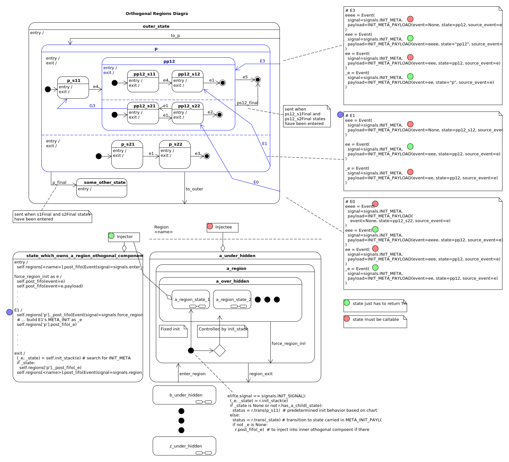
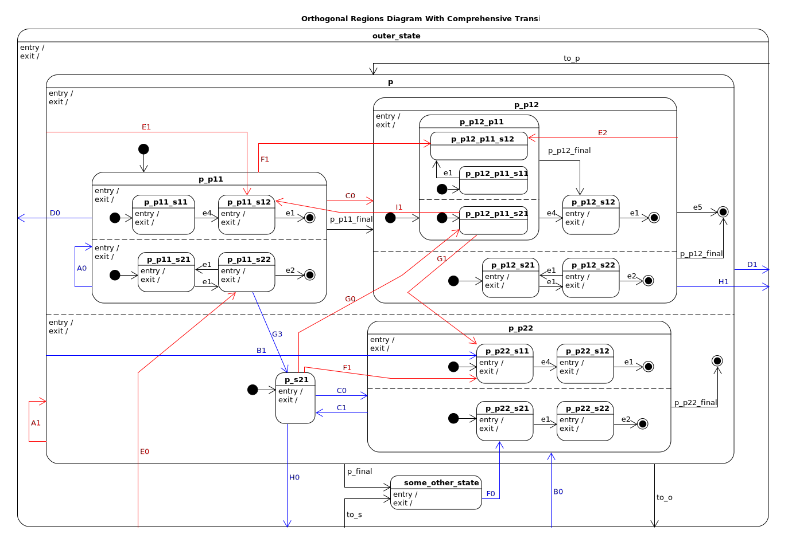

.. _recipes:

   *I'm writing these docs to help myself understand how to build an XML-to-miros parser.*

.. _recipes-recipes:

Recipes
=======

.. contents:: 
   :backlinks: entry

.. _recipes-summary:

Summary
^^^^^^^

I would like to support parallel statecharts using David Harel's notation.  The
Parallel statechart, or orthogonal regions are not supported by the algorithm
developed by Miro Samek.  However, Miro Samek offered an alternative and faster
pattern, the `orthorgonal component
<https://aleph2c.github.io/miros/patterns.html#patterns-orthogonal-component>`_;
an HSM within an HSM.

If you haven't seen orthogonal regions before reference `this document on
orthogonal regions and miros.
<https://aleph2c.github.io/miros/othogonalregions.html>`_.  

In this project and in these documents I will be writing about how to have one
orthogonal region communicate with another.  My implementation of orthogonal
regions will be a mapping of Miros Samek's orthogonal component pattern (HSMs
within other HSMs) onto a design which will look and behave like an orthogonal
region.  This will be done by recursively mapping orthogonal components within a
chart.  An outer region will ``dispatch`` events into a deeper or inner region.
The outer region which injects an event will be called an **Injector** and the
region which receives the events will be called an **Injectee**.  An HSM can both
be an **Injector** and an **Injectee**, and the outermost chart will only be an
**Injector**.

The chart will be run within the outermost HSM's thread, and the inner regions
will be driven by dispatching events and driving them through the orthogonal
component with the ``complete_circuit`` method.

To manifest transitions between regions, the queue of the various components
will be treated as call stacks into which instructions can be placed.  Otherwise
the majority of the chart will behave using the dynamics of the miros algorithm.

This document is being written so that I can invent enough theory and give
myself enough instruction so as to generalize the construction of any orthogonal
region, described by an XML document, within its ``<parallel>`` tag.

.. _recipes-context-and-terminology:

Context and Terminology
^^^^^^^^^^^^^^^^^^^^^^^

    Region
         HsmWithQueues object with addition supporting methods, in the software
         it is represented as a class.  In the design it is an othogonal
         component called the **injectee**.  In statechart theory, the othogonal
         region is one of the areas partitioned within a dashed line.  It and
         it's other regions are expected to run concurrently.

         .. image:: _static/region.svg
             :target: _static/region.pdf
             :align: center
         

    Regions
         Contains multiple Region objects in a collection.  It augments the
         regions so that they can reference one another using iterators.  It
         adds a ``_post_fifo`` and ``_post_lifo`` method which can put items
         into all of its inner region's queues.

         It adds a ``post_fifo`` and ``post_lifo`` method which will post items
         onto an inner queue, then drive the inner statecharts using their
         ``complete_circuit`` method until their queues are empty.

         .. image:: _static/regions.svg
             :target: _static/regions.pdf
             :align: center

    Injector:
         A statechart or orthogonal component which post events into an inner
         othergonal component, then drives the events through the region it is
         encapsulated.  The **injector** places events and drives events using
         the ``_post_fifo', ``post_fifo`` ... APIs.  The **p** and **pp12**
         states would be an injector in the following diagram:

         .. image:: _static/hidden_dynamics.svg
             :target: _static/hidden_dynamics.pdf
             :align: center

    Injectee:
         An othogonal component who's events are given to it, and driven through
         it by an **injector**.  An **injectee** can also be an **injector** if
         it drives another state.  An injector is hidden from view in the main
         statechart picture with the dashed lines.  However, you can see it at
         the bottom right of this picture.

         .. image:: _static/hidden_dynamics.svg
             :target: _static/hidden_dynamics.pdf
             :align: center

    WTF events
         Any event which crosses between regions.  See ``E0``, ``E1`` and ``E3``
         in the following diagram

         .. image:: _static/hidden_dynamics.svg
             :target: _static/hidden_dynamics.pdf
             :align: center

    Under Hidden States
         The outer state of an **injectee**.  It presents the illusion that a
         region can be exited.  It's a holding state with no initializtion
         handler, and it is the outer most state of the region.

    Region States
         This state is sandwiched between the under and outer hidden states.  It
         contains a ``INIT_SIGNAL`` handler which calls the ``init_stack``
         method which is used for managing ``META_INIT`` events (events which
         contain events and states to initialize to).  The region state also has
         a ``region_exit`` event handler which will cause the region to
         transition the **under hidden region**.

    Over Hidden States
         This state is above the region state and its purpose to to catch the
         ``force_region_init`` event, which will force a transition to the
         region, and thereby force a call of the ``init_state`` method.

    META_INIT
         An event which contains 0 or more META_INIT events and the state which
         are intended to handle the event.  They are injected into the queue of
         inner states so that the inner state's ``init_stack`` methods can
         programmatically initialize their region.

    META_EXIT
         An event which permits an WTF exit strategy

    META_SIGNAL_PAYLOAD
         The payload of a META event.

         .. code-block:: python
           
            META_SIGNAL_PAYLOAD = namedtuple(
               "META_SIGNAL_PAYLOAD", ['event', 'state', 'source_event', 'region']
            )

.. _recipes-writing-wtf-events-across-regions:

Writing WTF Events Across Regions
^^^^^^^^^^^^^^^^^^^^^^^^^^^^^^^^^

This section will contain the recipes needed to construct the blue ``WFT``
events, or events that span across parallel regions in this example program:

.. note::

  click on the diagram to open a pdf version of it.

.. _recipes-hidden-dynamics:

Hidden Dynamics
^^^^^^^^^^^^^^^

.. raw:: html

  <a class="reference internal" href="quickstart.html"prev</a>, <a class="reference internal" href="index.html#top">top</a>, <a class="reference internal" href="introduction.html">next</a>

