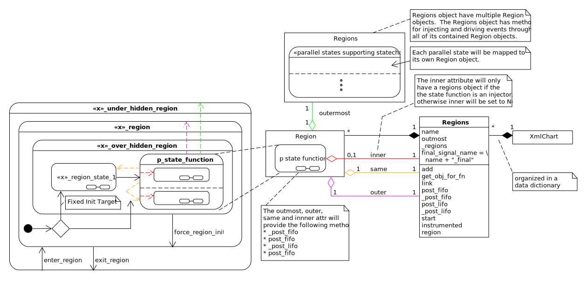
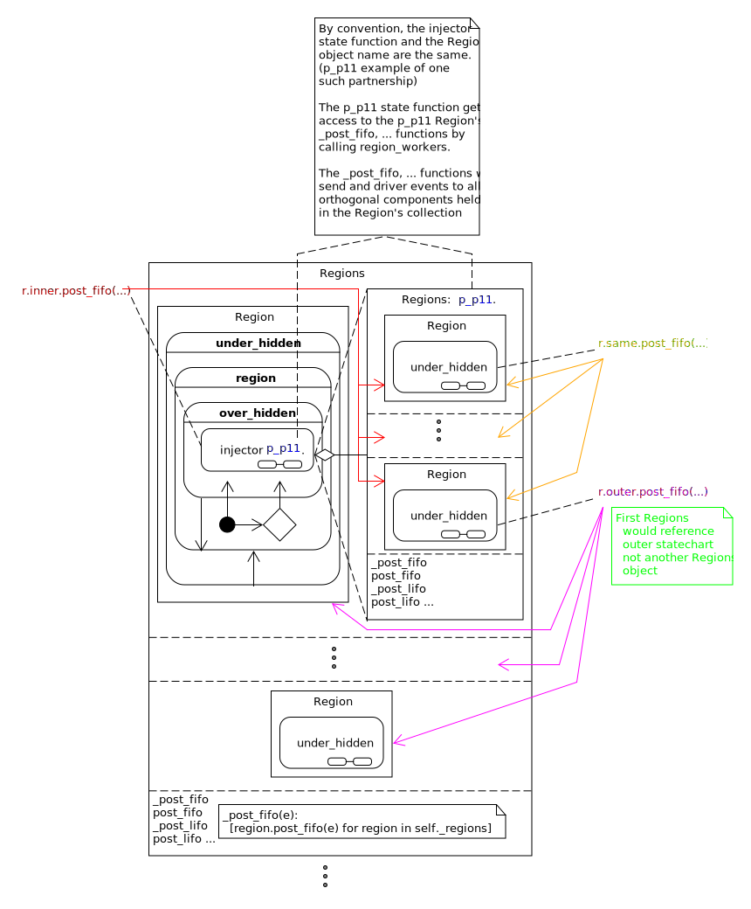
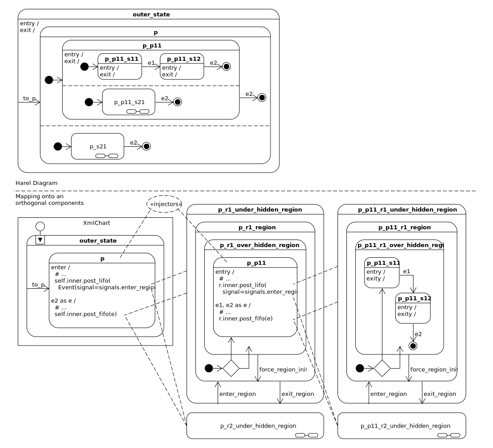
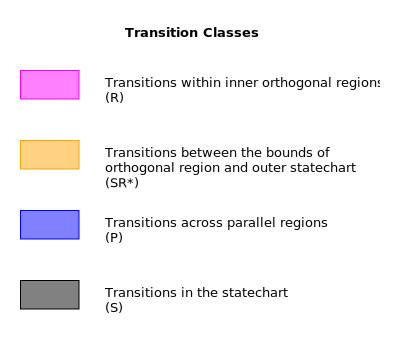
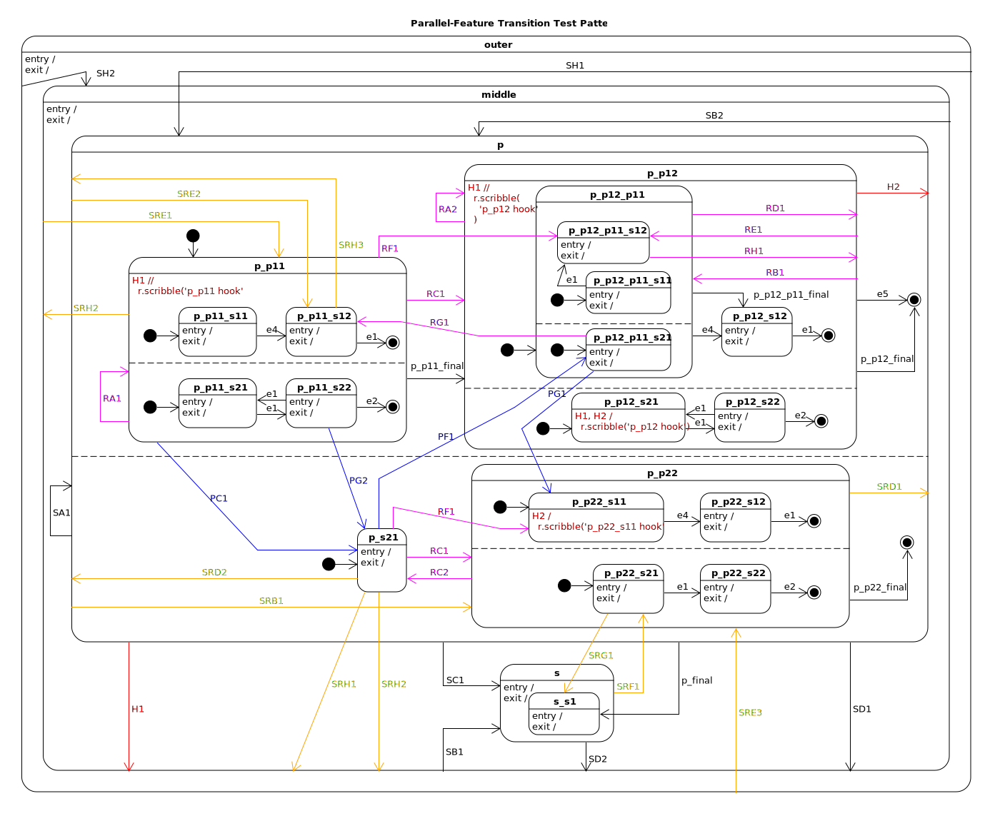
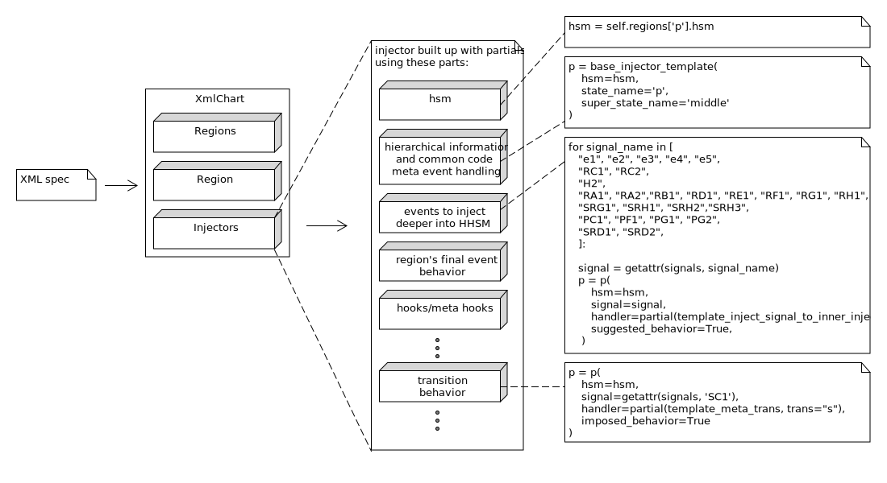

  Debugging is twice as hard as writing the code in the first place.  Therefore,
  if you write the code as cleverly as possible, you are, by definition, not smart
  enough to debug it.  -- **Brian Kernighan.**

.. note::

  This portion of the document is a collection of notes I have been taking as I
  write the software.  It is me, writing to think through the problem.  It is
  not meant for general consumption, since a lot of the words/definitions used
  to describe the system are inconsistent; it's a work in progress.

  But if you would like to follow this document, first make sure you have a
  firm understanding of the miros library.

.. _how_it_works:

How it Works
============

.. contents::
  :depth: 2
  :local: 
  :backlinks: none

.. _how_it_works-subsection-title:

Context and Design Goal
^^^^^^^^^^^^^^^^^^^^^^^

Here is an example of a statechart diagram written using David Harel's parallel
region's drawing technique:

.. image:: _static/xml_chart_4.svg
    :target: _static/xml_chart_4.pdf
    :class: scale-to-fit

The state machines separated from one another with dashed lines are said to be
running in "parallel regions".  This means any event seen by the whole machine
will be seen by each region and both regions are expected to run concurrently as
if they were running on their own computer.  A statechart which supports the
parallel region pattern can have one or more active state at a time.  The event
processing algorithm used by miros does not support the parallel regions
pattern.

But miros *does* support the ability to place an HSM within another HSM.  This
is called the "orthogonal component" pattern (an HSM in an HSM).  Since the
state of an inner HSM is in a different state than the outer machine which holds
it, the orthogonal component pattern can have more than one active state like
the parallel region pattern.

The goal of this documentation is to show how to map the orthogonal component
pattern onto the parallel region pattern.

.. _how_it_works-structure-of-the-code:

Structure of the Code
^^^^^^^^^^^^^^^^^^^^^

From a very high level the code is structured like this:

.. image:: _static/class_relationships.svg
    :target: _static/class_relationships.pdf
    :class: noscale-center

The "orthogonal components" will be the Region objects described in the diagram
above.  An "orthogonal component" is another name for an HSM inside of another
HSM.  So our Region objects will have to run within another HSM.  They will
either run within the outmost XmlChart statechart object or within another
Region object.

The Region class is derived from the HsmWithQueues class. HsmWithQueues objects
don't have their own threads to watch for incoming events so neither will any
Region object.  The outmost XmlChart's thread will have to watch for new events
in its queue, then begin the process of driving these events deeper and deeper
into its inner region objects.

The management, communication and graphical organization of all of the Region
objects, relative to one another, will be managed by a Regions object.  Through
the Regions methods, any region can access the methods controlling other regions
it is adjacent to in the hierarchy of HSMs via the  ``inner``, ``same`` and
``outer`` attributes.

The XmlChart has many Regions and it inherits from the InstrumentedActiveObject
which is just an ActiveObject with some additional logging and customized
instrumentation features.  Since the XmlChart inherits from the ActiveObject, it
will have a thread and a set of queues which can receive events asynchronously
from programs running in other threads.  The thread of the XmlChart will drive
all of its inner hierarchical state machines, and it will filter and drive
events deeper and deeper into it's architecture to perform the behaviors
specified by the Harel drawing formalism.

Each region object has access to the methods of the XmlChart object via their
``outmost`` attribute.

.. _how_it_works-how-the-region-class-relates-to-the-parallel-region-drawing:

How the Region Class Relates to the Parallel Region Drawing
^^^^^^^^^^^^^^^^^^^^^^^^^^^^^^^^^^^^^^^^^^^^^^^^^^^^^^^^^^^

There will be one Region object for every region in a diagram which supports the
dashed line notation:

.. image:: _static/region.svg
    :target: _static/region.pdf
    :class: scale-to-fit

A Region is just an HsmWithQueues with some additional methods; so it's just an
HSM.  The Region will be attached to a state machine who's inner part is
identical to that in the parallel region diagram, but with three additional
outer states and event handlers.  These outer structures will be invisible to
the user, and will provide the means to control the orthogonal component so that
its inner state machine will behave as if it was a parallel state.  I will talk
more about these outer structures later, but for now know that they are just
there to map one technique onto another.

Parallel regions occur within a state.  A state function that needs to connect
to inner, embedded HSMs will use the Regions object to do this work.

.. _how_it_works-how-the-regions-class-organizes-a-graph-of-region-objects:

How the Regions Class Organizes a Graph of Region Objects
^^^^^^^^^^^^^^^^^^^^^^^^^^^^^^^^^^^^^^^^^^^^^^^^^^^^^^^^^

The Regions object is constructed within the XmlChart class.  A Regions object
can construct and own many different region objects.

The Regions class can inject and drive events into all of the Region objects it
controls.

For an HHSM to work, a state function operating in one HSM (region) will have to
be able to drive events into other HSMs (other regions).  The Regions class
provides this ability: it allows a state function to drive events to inner, same
or outer levels of the layered HSM hierarchy.

Both the Regions objects and the outmost statechart object, XmlChart, have
``post_fifo``, ``post_lifo`` and a host of other event control and driving
mechanisms.  Since the Regions class and the XmlChart class use the same names
for the methods that do this work, you can say they are polymorphic; they have
the same interface.  A state function will need to aim these methods at
different levels of the hierarchical HSM.

The Regions objects have limited graphical information.  They only know about
the "outer", "same" and "inner" information of the Region objects they own:

* ``outmost``: The outer most statechart object. (green line)
* ``outer``: HSMs one layer out in the parallel regions diagram. (magenta line)
* ``same``: HSMs within the same parallel region. (orange line)
* ``inner``: HSMs mapping to an inner parallel region of the state. (red line)

The ``outmost``, ``outer`` and ``same`` attributes will be linked to a Region
object at its moment of creation by the Regions object.  The ``inner`` attribute
is set dynamically because the ``inner``
attribute is not something that will apply to an entire region object. The
region object will contain many different states in the region and only the
injector will need a connection to the inner region.  To see what I mean, look
at ``<<x>>_region_state_1``, it will not have the same ``inner`` relation that
``p_state_function`` will have to the parallel regions contained within
``p_state_function``.

But a function can't really own anything in OO theory.  If you read the code you
will see that the ``inner`` attribute is assigned dynamically by a decorator.

.. _injectors_2:

Injector State Functions, Region Objects and Regions Objects in a Graph
^^^^^^^^^^^^^^^^^^^^^^^^^^^^^^^^^^^^^^^^^^^^^^^^^^^^^^^^^^^^^^^^^^^^^^^

State functions have Regions objects which have Region objects which have state
functions.  This is all very confusing.  Seeing how things inter-relate in a
graph would be nice, but this is not supported with idiomatic UML.

So we will break the rules and describe their graphical relationship like so:

* ``r.outer.post_fifo(...)``: post to all HSMs one level up in the hierarchy (magenta line)
* ``r.same.post_fifo(...)``: post to all HSMs at the same level of the hierarchy (orange line)
* ``r.inner.post_fifo(...)``: post to all inner HSMs in the state. (red line)

Place your eyes on the outer most Regions object.  It has multiple region
objects.  Its top most region object drives a partially drawn HSM.  Within this
HSM is an **injector**, or a state function that has parallel regions within it.
This **injector** function is called p_p11.

The p_p11 injector function needs to control the collection of inner region
objects, so it makes ``r.inner.post_fifo(...)`` calls to do this.  By convention
the Regions object is given the same name as the injector which needs its
methods.

Now look within the regions being managed within the p_p11 Regions object.  If a
state machine inside of one of its orthogonal components needs to use the
``r.same.post_fifo(...)``, it will be posting and driving events through all of its sibling
orthogonal components.

There will be times when a state function needs to call to drive events through
its super-region or parent region components.  To do this it uses the
``r.outer.post_fifo(...)`` syntax.

Not included on the above diagram is a posting to the outer statechart, this
would be done as ``r.outmost.post_fifo(...)``.

.. _how_it_works-how-the-xmlchart-organizes-its-regions:

How the XmlChart Organizes its Regions
^^^^^^^^^^^^^^^^^^^^^^^^^^^^^^^^^^^^^^

.. image:: _static/XmlChart.svg
    :target: _static/XmlChart.pdf
    :class: noscale-center

The XmlChart class is a statechart which has a bunch of Regions objects, which
in turn manage groups of orthogonal components (Region objects).  I have
discussed the inner dynamics already so I will focus now on how Regions
objects are organized within the XmlChart class: they are in a data dictionary.
This dictionary has key names that match the **injector** functions that own
them.

Each state function will receive a handle to its Region object and an event.
All Region objects will have an attribute that points to the outmost chart, the
XmlChart object.  It is through this reference that the Regions objects are
looked up to get the methods required to post and drive events to other regions.

The XmlChart is the only HSM in the whole system that has a thread.  This thread
must be used to drive all of the inner HSMs.  It acts like the spring drive in a
mechanical watch; it drives gears which drive smaller gears which drive smaller
gears.  Any event that is passed to our chart must first be managed by the
XmlChart class, then pushed into the inner Regions.  All **injector** functions
will also drive their received external events deeper and deeper into the chart
until the whole collective RTC event is finished.

.. _how_it_works-hidden-states-and-what-they-are-for:

Hidden States and What They are For
^^^^^^^^^^^^^^^^^^^^^^^^^^^^^^^^^^^

The state machines inside of a Region will mostly look the same as how they will
look on a David Harel diagram, or how they are structured within the 
 tag of
the XML.  But for the mapping of one pattern onto another, three additional
states wrap the state-machine within a parallel region.  See the diagram below:

.. image:: _static/parallel_region_to_orthogonal_component_mapping_1.svg
    :target: _static/parallel_region_to_orthogonal_component_mapping_1.pdf
    :class: noscale-center

The wrapper states are described here:

* The **under_hidden_region** state presents the illusion that our region can be
  exited.  The orthogonal component pattern allows us an HSM within an HSM, but
  the parallel pattern needs a whole region to exit when it turns off.  This
  exiting behavior is captured by this **under_hidden_region**.

* The **region** state is sandwiched between the under and over hidden states.
  It contains an ``INIT_SIGNAL`` handler which can either cause a transition to
  the default state (see p1_s11 in the diagram) or it can be aimed
  programmatically.

* The **over_hidden** state's sole purpose is to cause a re-initialization event
  from any of it's substates, so that the programmable init arrow of the region
  state can be run any time.

Here we see how the parallel region is mapped onto the orthogonal component with a
bit more detail about the Regions object and Region objects:

.. image:: _static/parallel_region_to_orthogonal_component_mapping_2.svg
    :target: _static/parallel_region_to_orthogonal_component_mapping_2.pdf
    :class: noscale-center

.. _how_it_works-how-the-parallel-region-is-mapped-onto-the-orthogonal-component:

How the Parallel-Region is mapped onto the Orthogonal Component
^^^^^^^^^^^^^^^^^^^^^^^^^^^^^^^^^^^^^^^^^^^^^^^^^^^^^^^^^^^^^^^

To get events into the inner regions of the chart you must pass them via the
**injectors** (p in this diagram):

.. image:: _static/parallel_region_to_orthogonal_component_mapping_3.svg
    :target: _static/parallel_region_to_orthogonal_component_mapping_3.pdf
    :class: noscale-center

From the top diagram we can see how the bottom diagram should work.  If we start
the chart in the outer_state, send a ``to_p``, then send an ``e1``,  the active
states should be ``['p_s12', '...']``.

Now look at how an event is injected into a parallel region inside of another parallel region:

If we start the chart in the outer_state, send a ``to_p``, then send an ``e1``,
the chart should settle into ``[['p_p11_s12', '...'], '...']``.

From this simple exercise we can see how the pictorial-descriptive-power of the
orthogonal components is being completely outclassed by the Harel-parallel-regions
drawing technique.

Now imagine the orthogonal component diagram for this:

.. image:: _static/xml_chart_4.svg
    :target: _static/xml_chart_4.pdf
    :class: scale-to-fit

I could draw it, but it would stop being useful.

Now imagine trying to draw the above using finite state machines.  It may be
possible, but I know I wouldn't want to do it, and I certainly wouldn't want to
maintain the diagram and its code base.

.. _how_it_works-wtf-transitions-meta-events-and-transitions-across-parallel-regions:

WTF Transitions, Meta Events and Transitions Across Parallel Regions
^^^^^^^^^^^^^^^^^^^^^^^^^^^^^^^^^^^^^^^^^^^^^^^^^^^^^^^^^^^^^^^^^^^^

I named the transitions across parallel regions WTF transitions (or WTF events),
because initially I had no idea how to implement them.  Eventually I discovered
a way to get them working: I made events which carried other events which could
react to custom event handlers written into many of the state functions.

Since an event carrying information about another event in its payload is a kind
of meta phenomenon, I decided to call these events, meta-events.

.. _how_it_works-a-walk-through-of-a-wtf-transition,-case-1:

A Walk through of a WTF Transition, Case 1
^^^^^^^^^^^^^^^^^^^^^^^^^^^^^^^^^^^^^^^^^^

Here is a walk through of our first WFT transition: ``E0``

.. image:: _static/parallel_region_to_orthogonal_component_mapping_5.svg
    :target: _static/parallel_region_to_orthogonal_component_mapping_5.pdf
    :class: scale-to-fit

We will use meta events to pass messages in and out of orthogonal components.
As you walk through the code, remember that ``_post_fifo`` and ``_post_lifo``
only place events into the queues of all of the regions connected to those
calls.  ``post_fifo`` and ``post_lifo`` place events *and* drives those events
through their connected orthogonal components.

If we started the above chart in the outer_state and sent it an ``E0`` we would
end up in the ``[['p_p11_s12', '...'], ['...']]`` states.

The code that makes the programmable init work isn't on the diagram, but it
looks like this:

.. code-block:: python

  elif(e.signal == signals.INIT_SIGNAL):
    (_e, _state) = r.peel_meta(e) # search for INIT_META
    # if _state is a child of this state then transition to it
    if _state is None or not rr.has_a_child(_state):
      status = r.trans(p_p11)  # the default state to transition to
    else:
      status = r.trans(_state)
      if not _e is None:
        rr.post_fifo(_e)

.. note::

  As I continued on the project, I extended the trouble shooting code included
  with the miros python libray.  To have a meta-event trace appear in your logs,
  look for the definition of ``events_to_investigate`` at the top of your
  experiment file and assign the signal name of the meta event you want to
  investigate:

   .. code-block:: python

     events_to_investigate = 'E1'

A Walk through of a WTF Transition, Case 2
^^^^^^^^^^^^^^^^^^^^^^^^^^^^^^^^^^^^^^^^^^

Let's focus on something a bit more difficult, the ``G1`` WTF event (click to
enlarge):

.. image:: _static/parallel_region_to_orthogonal_component_mapping_6.svg
    :target: _static/parallel_region_to_orthogonal_component_mapping_6.pdf
    :class: scale-to-fit

From the top Harel diagram, we see that if the system is in ``p_p11_s12`` and we
receive a ``G1`` we should transition into ``p_s22``.  But what happens to
region 1 of ``p``?  Well, we want it to be non-reactive, unless it is
explicitely reactivated by ``to_p``.

To summarize:

.. code-block:: bash
  
  [['p_p11_s12', 'p_p11_s21'], 'p_s21'] <- G1 \
    == ['p_r1_under_hidden_region', 'p_s22']

A Walk through of a WTF Transition, Case 3
^^^^^^^^^^^^^^^^^^^^^^^^^^^^^^^^^^^^^^^^^^

Let's focus on something a bit less difficult, the ``G0`` WTF event (click to
enlarge):

.. image:: _static/parallel_region_to_orthogonal_component_mapping_7.svg
    :target: _static/parallel_region_to_orthogonal_component_mapping_7.pdf
    :class: scale-to-fit

From the top Harel diagram, we see that if the system is in ``p_p22`` and we
receive a ``G0`` we should transition into ``p_p11_s12``.  Like the previous
example we want a region to become non-reactive, but in this case it's region 2
of ``p``.

To summarize:

.. code-block:: bash

  [['p_p11_s12', 'p_p11_s21'], 'p_s21'] <- G1 \
    == [['p_p11_s12', 'p_p11_s21'], 'p_r2_under_hidden_region']

.. _how_it_works-creating-a-systematic-way-of-naming-wtf-events:

Creating a Systematic way of Naming WTF Events
^^^^^^^^^^^^^^^^^^^^^^^^^^^^^^^^^^^^^^^^^^^^^^

This library will support events which transition across regional and parallel
boundaries.  To do this I need to figure out how to build a small testing
diagram from which I can test every supported transition type.  This testing
diagram will serve as the specification for the parallel region feature of this
library.

To begin this theoretical work lets start by examining the topological diagrams
taken from figure 4.6 on page 178 of Practical UML Statecharts in C/C++, Second
Addition.  Here, Miro Samek demonstrates what family of graphs are supported by
his event processor (then does a code walk through about how each graph is
supported).

.. figure:: _static/xml_chart_5_guidance_graphs.svg
   :target: _static/xml_chart_5_guidance_graphs.pdf
   :class: noscale-center

   From page 178 of Practical UML Statecharts in C/C++, Second Addition

Here is a coloured and named list of transition classes which are being added by
this library to provide the "parallel regions" feature:

To create a test pattern, I need to consider all combinations of the transition
types with the topological sub-graphs.

.. image:: _static/xml_chart_5_guidance.svg
    :target: _static/xml_chart_5_guidance.pdf
    :class: scale-to-fit

Not all transitions make sense, and the transitions mapped onto a nominal
statechart have already been verified; so instead of having to test 32 possible
topologies, we only have to map (at a minimum) 17 types of transitions.

These 17 types of transitions are mapped onto the following test
pattern:

Note that there are more than 17 different events being tested.  Some of the
events are there to conveniently transition from test to test and others are
there for testing the edge conditions of the design.

An event is named like this:

``<transition-type topology-type number>``

For example, PC1, is testing a parallel transition of the PC topology type.  PC1
is the first event that is testing this type of transition, so it is post-pended
with the number 1.

The test pattern is a good first step for figuring out what has to be tested to
build a robust feature.  At any time in the future, I can add more events (like
the red hooks).  If you are reading this and see a major bug in my theory, email
me and let me know.

.. _how_it_works-beastiary:

Beastiary
^^^^^^^^^

.. list-table::
  :widths: 20 30
  :header-rows: 1
  :align: left

  * - Transition Type
    - Name
  * - R: Transitions within inner orthogonal regions
    -
      :ref:`RA1 <RA1>`
      :ref:`RA2 <RA2>`
      :ref:`RB1 <RB1>`
      :ref:`RC1 <RC1>`
      :ref:`RC2 <RC2>`
      :ref:`RD1 <RD1>`
      :ref:`RE1 <RE1>`
      :ref:`RF1 <RF1>`
      :ref:`RG1 <RG1>`
      :ref:`RH1 <RH1>`
  * - SR: Transitions between the bounds of the orthogonal region and outer statechart
    - 
      :ref:`SRB1 <SRB1>`
      :ref:`SRD1 <SRD1>`
      :ref:`SRD2 <SRD2>`
      :ref:`SRE1 <SRE1>`
      :ref:`SRE2 <SRE2>`
      :ref:`SRE3 <SRE3>`
      :ref:`SRF1 <SRF1>`
      :ref:`SRG1 <SRG1>`
  * - P: Transitions across parallel regions
    -
      :ref:`PC1 <PC1>`
      :ref:`PF1 <PF1>`
      :ref:`PG1 <PG1>`
      :ref:`PG2 <PG2>`
  * - H: Hooks and transitions
    -
      :ref:`H1 <H1>`
      :ref:`H2 <H2>`
  * - S: Standard Transitions
    -
      :ref:`SA1 <SA1>`
      :ref:`SB1 <SB1>`
      :ref:`SC1 <SC1>`
      :ref:`SD1 <SD1>`
      :ref:`SH1 <SH1>`
      :ref:`SH2 <SH2>`
  * - final: An SCXML addon.  When all regions of a state transition to their final pseudostate, create then post an artificial event with the signal name equal to the outer state holding the regions, with the string "_final" post pended to the signal's name.
    - 
      :ref:`p_p11_final <p_p11_final>`
      :ref:`p_p12_final <p_p12_final>`
      :ref:`p_p22_final <p_p22_final>`

.. list-table::
  :widths: 5 15 15 25 6
  :header-rows: 1
  :align: left

  * - Event Name
    - Where to look
    - Transition Type
    - Topological Type or Notes
    - ✓/✗
  * - RA1
    - p_p11 to p_p11
    - R: transitions within inner orthogonal regions

      .. image:: _static/r_transition_class.svg
          :target: _static/r_transition_class.pdf
          :class: noscale-center
    - 
      .. image:: _static/a_t.svg
          :target: _static/a_t.pdf
          :class: noscale-center
    - .. _RA1:

      ✓
  * - RA2
    - p_p12 to p_p12
    - R: transitions within inner orthogonal regions

      .. image:: _static/r_transition_class.svg
          :target: _static/r_transition_class.pdf
          :class: noscale-center
    - 
      .. image:: _static/a_t.svg
          :target: _static/a_t.pdf
          :class: noscale-center
    - .. _RA2:

      ✓
  * - RB1
    - p_p12 to p_p12_p11
    - R

      .. image:: _static/r_transition_class.svg
          :target: _static/r_transition_class.pdf
          :class: noscale-center
    - 
      .. image:: _static/b_t.svg
          :target: _static/b_t.pdf
          :class: noscale-center
    - .. _RB1:

      ✓
  * - RC1
    - p_p11 to p_p12
    - R: transitions within inner orthogonal regions

      .. image:: _static/r_transition_class.svg
          :target: _static/r_transition_class.pdf
          :class: noscale-center
    - 
      .. image:: _static/c_t.svg
          :target: _static/c_t.pdf
          :class: noscale-center
    - .. _RC1:

      ✓
  * - RC2
    - p_p22 to p_s21
    - R: transitions within inner orthogonal regions

      .. image:: _static/r_transition_class.svg
          :target: _static/r_transition_class.pdf
          :class: noscale-center
    - 
      .. image:: _static/c_t.svg
          :target: _static/c_t.pdf
          :class: noscale-center
    - .. _RC2:

      ✓
  * - RD1
    - p_p12_p11 to p_p12
    - R: transitions within inner orthogonal regions

      .. image:: _static/r_transition_class.svg
          :target: _static/r_transition_class.pdf
          :class: noscale-center
    - 
      .. image:: _static/d_t.svg
          :target: _static/d_t.pdf
          :class: noscale-center
    - .. _RD1:

      ✓
  * - RE1
    - p_p12 to p_p12_p11_s12
    - R: transitions within inner orthogonal regions

      .. image:: _static/r_transition_class.svg
          :target: _static/r_transition_class.pdf
          :class: noscale-center
    - 
      .. image:: _static/e_t.svg
          :target: _static/e_t.pdf
          :class: noscale-center
    - .. _RE1:

      ✓
  * - RF1
    - p_p11 to p_p12_p11_p12
    - R: transitions within inner orthogonal regions

      .. image:: _static/r_transition_class.svg
          :target: _static/r_transition_class.pdf
          :class: noscale-center
    - 
      .. image:: _static/f_t.svg
          :target: _static/f_t.pdf
          :class: noscale-center
    - .. _RF1:

      ✓
  * - RG1
    - p_p12_p11_s21 to p_p11_s12
    - R: transitions within inner orthogonal regions

      .. image:: _static/r_transition_class.svg
          :target: _static/r_transition_class.pdf
          :class: noscale-center
    - 
      .. image:: _static/g_t.svg
          :target: _static/g_t.pdf
          :class: noscale-center
    - .. _RG1:

      ✓
  * - RH1
    - p_p12_p11_s12 to p_p12
    - R: transitions within inner orthogonal regions

      .. image:: _static/r_transition_class.svg
          :target: _static/r_transition_class.pdf
          :class: noscale-center
    - 
      .. image:: _static/h_t.svg
          :target: _static/h_t.pdf
          :class: noscale-center
    - .. _RH1:

      ✓
  * -
    -
    -
    -
    -
  * - SRB1
    - p to p_p22
    - SR: Transition between the bounds of the orthogonal region and outer statechart

      .. image:: _static/sr_transition_class.svg
          :target: _static/sr_transition_class.pdf
          :class: noscale-center
    - 
      .. image:: _static/b_t.svg
          :target: _static/b_t.pdf
          :class: noscale-center
    - .. _SRB1:

      ✓
  * - SRD1
    - p_p22 to p
    - SR: Transition between the bounds of the orthogonal region and outer statechart

      .. image:: _static/sr_transition_class.svg
          :target: _static/sr_transition_class.pdf
          :class: noscale-center
    - 
      .. image:: _static/d_t.svg
          :target: _static/d_t.pdf
          :class: noscale-center
    - .. _SRD1:

      ✓
  * - SRD2
    - p_s21 to p
    - SR: Transition between the bounds of the orthogonal region and outer statechart

      .. image:: _static/sr_transition_class.svg
          :target: _static/sr_transition_class.pdf
          :class: noscale-center
    - 
      .. image:: _static/d_t.svg
          :target: _static/d_t.pdf
          :class: noscale-center
    - .. _SRD2:

      ✓
  * - SRE1
    - middle to p_p11
    - SR: Transition between the bounds of the orthogonal region and outer statechart

      .. image:: _static/sr_transition_class.svg
          :target: _static/sr_transition_class.pdf
          :class: noscale-center
    - 
      .. image:: _static/e_t.svg
          :target: _static/e_t.pdf
          :class: noscale-center
    - .. _SRE1:

      ✓
  * - SRE2
    - p to p_p11_s12
    - SR: Transition between the bounds of the orthogonal region and outer statechart

      .. image:: _static/sr_transition_class.svg
          :target: _static/sr_transition_class.pdf
          :class: noscale-center
    - 
      .. image:: _static/e_t.svg
          :target: _static/e_t.pdf
          :class: noscale-center
    - .. _SRE2:

      ✓
  * - SRE3
    - outer to p_p22_s22
    - SR: Transition between the bounds of the orthogonal region and outer statechart

      .. image:: _static/sr_transition_class.svg
          :target: _static/sr_transition_class.pdf
          :class: noscale-center
    - 
      .. image:: _static/e_t.svg
          :target: _static/e_t.pdf
          :class: noscale-center
    - .. _SRE3:

      ✓
  * - SRF1
    - s to p_p22_s21
    - SR: Transition between the bounds of the orthogonal region and outer statechart

      .. image:: _static/sr_transition_class.svg
          :target: _static/sr_transition_class.pdf
          :class: noscale-center
    - 
      .. image:: _static/f_t.svg
          :target: _static/f_t.pdf
          :class: noscale-center
    - .. _SRF1:

      ✓
  * - SRG1
    - p_p22_s21 to s_s1
    - SR: Transition between the bounds of the orthogonal region and outer statechart

      .. image:: _static/sr_transition_class.svg
          :target: _static/sr_transition_class.pdf
          :class: noscale-center
    - 
      .. image:: _static/g_t.svg
          :target: _static/g_t.pdf
          :class: noscale-center
    - .. _SRG1:

      ✓
  * - SRH1
    - p_s21 to outer
    - SR: Transition between the bounds of the orthogonal region and outer statechart

      .. image:: _static/sr_transition_class.svg
          :target: _static/sr_transition_class.pdf
          :class: noscale-center
    - 
      .. image:: _static/h_t.svg
          :target: _static/h_t.pdf
          :class: noscale-center
    - .. _SRH1:

      ✓
  * - SRH2
    - p_p11 to middle
    - SR: Transition between the bounds of the orthogonal region and outer statechart

      .. image:: _static/sr_transition_class.svg
          :target: _static/sr_transition_class.pdf
          :class: noscale-center
    - 
      .. image:: _static/h_t.svg
          :target: _static/h_t.pdf
          :class: noscale-center
    - .. _SRH2:

      ✓
  * - SRH3
    - p_p11_s12 to p
    - SR: Transition between the bounds of the orthogonal region and outer statechart

      .. image:: _static/sr_transition_class.svg
          :target: _static/sr_transition_class.pdf
          :class: noscale-center
    - 
      .. image:: _static/h_t.svg
          :target: _static/h_t.pdf
          :class: noscale-center
    - .. _SRH3:

      ✓
  * -
    -
    -
    -
    -
  * - PC1 
    - p_p11 to p_s21
    - P: Transitions across parallel regions

      .. image:: _static/p_transition_class.svg
          :target: _static/p_transition_class.pdf
          :class: noscale-center
    - 
      .. image:: _static/c_t.svg
          :target: _static/c_t.pdf
          :class: noscale-center
    - .. _PC1:

      ✓
  * - PF1 
    - p_s21 to p_p12_p11_s21
    - P: Transitions across parallel regions

      .. image:: _static/p_transition_class.svg
          :target: _static/p_transition_class.pdf
          :class: noscale-center
    - 
      .. image:: _static/f_t.svg
          :target: _static/f_t.pdf
          :class: noscale-center
    - .. _PF1:

      ✓
  * - PG1 
    - p_p12_p11_s21 to p_p22_s11
    - P: Transitions across parallel regions

      .. image:: _static/p_transition_class.svg
          :target: _static/p_transition_class.pdf
          :class: noscale-center
    - 
      .. image:: _static/g_t.svg
          :target: _static/g_t.pdf
          :class: noscale-center
    - .. _PG1:

      ✓
  * - PG2 
    - p_p11_s22 to p_s21
    - P: Transitions across parallel regions

      .. image:: _static/p_transition_class.svg
          :target: _static/p_transition_class.pdf
          :class: noscale-center
    - 
      .. image:: _static/g_t.svg
          :target: _static/g_t.pdf
          :class: noscale-center
    - .. _PG2:

      ✓
  * -
    -
    -
    -
    -
  * - H1
    - p to middle, p_p12, p_p11, p_p12_s21
    - hook
    - hook
    - .. _H1:

      ✓
  * - H2
    - p_p22_s11
    - hook
    - hook
    - .. _H2:

      ✓
  * -
    -
    -
    -
    -
  * - SA1
    - middle to p
    - S: Standard transition

      .. image:: _static/s_transition_class.svg
          :target: _static/s_transition_class.pdf
          :class: noscale-center
    - 
      .. image:: _static/a_t.svg
          :target: _static/a_t.pdf
          :class: noscale-center
    - .. _SA1:

      ✓
  * - SB1
    - middle to p
    - S: Standard transition

      .. image:: _static/s_transition_class.svg
          :target: _static/s_transition_class.pdf
          :class: noscale-center
    - 
      .. image:: _static/b_t.svg
          :target: _static/b_t.pdf
          :class: noscale-center
    - .. _SB1:

      ✓
  * - SC1
    - p to s
    - S: Standard transition

      .. image:: _static/s_transition_class.svg
          :target: _static/s_transition_class.pdf
          :class: noscale-center
    - 
      .. image:: _static/c_t.svg
          :target: _static/c_t.pdf
          :class: noscale-center
    - .. _SC1:

      ✓
  * - SD1
    - p to middle
    - S: Standard transition

      .. image:: _static/s_transition_class.svg
          :target: _static/s_transition_class.pdf
          :class: noscale-center
    - 
      .. image:: _static/d_t.svg
          :target: _static/d_t.pdf
          :class: noscale-center
    - .. _SD1:

      ✓
  * - SH1
    - outer to p
    - S: Standard transition

      .. image:: _static/s_transition_class.svg
          :target: _static/s_transition_class.pdf
          :class: noscale-center
    - 
      .. image:: _static/h_t.svg
          :target: _static/h_t.pdf
          :class: noscale-center
    - .. _SH1:

      ✓
  * - SH2
    - outer to middle
    - S: Standard transition

      .. image:: _static/s_transition_class.svg
          :target: _static/s_transition_class.pdf
          :class: noscale-center
    - 
      .. image:: _static/h_t.svg
          :target: _static/h_t.pdf
          :class: noscale-center
    - .. _SH2:

      ✓
  * -
    -
    -
    -
    -
  * - p_p11_final
    - p_p11 to p_p12
    - final: SCXML addon
    - Any topology
    - .. _p_p11_final:

      ✓
  * - p_p12_final
    - p_p12 to final pseudostate inside of r1 of p
    - final: SCXML addon
    - Any topology
    - .. _p_p12_final:

      ✓
  * - p_p22_final
    - p_p22 to final pseudostate inside of r2 of p
    - final: SCXML addon
    - Any topology
    - .. _p_p22_final:

      ✓

.. _how_it_works-construction-strategy:

Construction Tactics
^^^^^^^^^^^^^^^^^^^^

To provide the parallel region feature, miros-xml writes a bunch of miros statechart
code for you.  The concurrent parallel states behavior is mimicked by linking a bunch of
orthogonal regions together with hidden states and special handling of recursively
structured events.  This section describes how these features were constructed.

This package uses a set of naming conventions when trying to decide what to call
hidden states, regions, and final signals.  In this way it takes a "convention
over configuration" approach.  The convention emerged from wrestling with the
problem, and on the most part it should be hidden from view.
Nonetheless, this convention is described in this section so that I can write
them down as they are invented.

.. contents::
  :depth: 3
  :local: 
  :backlinks: none

.. _how_it_works-experimental-files:

Experimental Files
------------------

The parallel region feature is being built out using four files:

* ``/experiment/logger_config.yaml``
* ``/experiment/xml_chart_5.py``
* ``/experiment/augment.py``
* ``/experiment/xml_chart_5.2.py``

The ``logger_config.yml`` contains logging specifications.  It is very difficult to
trace a recursive WTF event as it is being passed between various orthogonal
states.  Logging drops the instrumentation records, what was done by which part
of the program into files that can be inspected in great detail.

The ``xml_chart_5.py`` file is flat in its architecture.  All of the state functions
are written out by hand, so a lot of the code is copied and pasted.  The
xml_chart_5.py was the program used to build up the hidden state features and
meta event handling.  It has been left in this flat state to make it easy to
debug WTF event logic.

The ``augment.py`` was used to demonstrate :ref:`advanced-partial-function
techniques <techniques-adding-and-removing-behavior-from-functions>`
like, asking a partial to add or removed behavior from itself, and return a new
working function that can be added to a statemachine.  These partial functions
can also be called in such a way that they will describe what they do.

The ``xml_chart_5.2.py`` file uses the techniques of augment.py to squish
the longer functions of xml_chart_5.py into a collection of smaller templates.

The regression tests for these programs are written within them, so a program can
just be run to see if it is working.  While working on a program I watch for
file modifications, then run the program to test itself:

.. code-block:: python

  sudo apt install -y inotify-tools  # install a file-watcher

  # use the file-watcher to re-run a test when it detects changes to a file
  while inotifywait -e modify xml_chart_5.2.py logger_config.yaml;\
    do python xml_chart_5.2.py; done

.. _how_it_works-naming-conventions:

Naming Conventions
------------------

.. note::

  This section applies to ``xml_chart_5.py``, ``logger_config.yaml`` and ``xml_chart_5.2.py``.

Rules:

  * An injector function and its region have the same name
  * final signal name: '<regions_name>_final'
  * WTF meta event names: `<purpose>_META_SIGNAL`, where purpose is ``INIT``,
    ``EXIT``, ``BOUNCE_SAME``, ``BOUNCE_ACROSS``
  * ``OUTER_TRANS_REQUIRED``

.. _how_it_works-automatic-construction-of-hidden-states:

Automatic Construction of Hidden States
---------------------------------------

.. note::

  This section applies to ``xml_chart_5.2.py``

.. include:: i_creating_functions_from_templates.rst

.. _how_it_works-automatic-construction-of-injectors:

Automatic Construction of Injectors
-----------------------------------

.. note::

  This section applies to ``xml_chart_5.2.py``

State functions have Regions objects which have Region objects which have state
functions.

A parallel region can exist inside of any state function.  In this architecture, the
parallel regions feature is contained within a regions object.  If the regions
object exists within a state, that state is called an injector.  An injector has
the same name as the regions object it controls.

An injector is structured like any state function, it consists of a large
if-elif-else structure that helps the event processor make sense of the HSM's
graph.  To make an injector handle the meta-events, or the events that give the
illusion of a parallel region, it contains special handling for
``INIT_META_SIGNAL``, ``EXIT_META_SIGNAL`` and so on.

Here is an example of an injector from ``xml_chart_5.py``, with the code common to
all injectors highlighted.

.. code-block:: python
  :emphasize-lines: 1, 3, 7-12, 14-28, 84-133
  :linenos:

  @othogonal_state
  def p_p11(r, e):
    status = return_status.UNHANDLED
    __super__ = p_r1_over_hidden_region
    __hooks__ = [signals.H1]

    if(e.signal == SEARCH_FOR_SUPER_SIGNAL):
      r.temp.fun = __super__
      return return_status.SUPER
    elif(e.signal == signals.SEARCH_FOR_META_HOOKS):
      if e.payload.event.signal in __hooks__:
        return return_status.HANDLED

    # enter all regions
    if(e.signal == signals.ENTRY_SIGNAL):
      r.p_spy(e)
      rsm(p_p11, e)
      # search for INIT_META_SIGNAL
      (_e, _state) = r.meta_peel(e)
      investigate(r, e, _e)
      if _state:
        r.inner._post_fifo(_e)
      status = return_status.HANDLED
    elif(e.signal == signals.INIT_SIGNAL):
      r.p_spy(e)
      rsm(p_p11, e)
      r.inner.post_lifo(Event(signal=signals.enter_region))
      status = return_status.HANDLED
    # any event handled within there regions must be pushed from here
    elif(token_match(e.signal_name, "e1") or
         token_match(e.signal_name, "e2") or
         token_match(e.signal_name, "e4") or
         token_match(e.signal_name, "SRH3") or
         token_match(e.signal_name, "PG2")
         ):
      r.p_spy(e)
      r.inner.post_fifo(e)
      status = return_status.HANDLED
    elif(token_match(e.signal_name, "H1")):
      r.scribble("p_p11 hooked")
      status = return_status.HANDLED
    elif token_match(e.signal_name, r.outmost.regions['p_p11'].final_signal_name):
      r.p_spy(e)
      status = r.trans(p_p12)
    elif token_match(e.signal_name, "RC1"):
      r.p_spy(e)
      status = r.meta_trans(
        e=e,
        s=p_p11,
        t=p_p12,
      )
    elif token_match(e.signal_name, "SRH2"):
      r.p_spy(e)
      status = r.meta_trans(
        e=e,
        s=p_p11,
        t=middle,
      )
    elif token_match(e.signal_name, "RA1"):
      r.p_spy(e)
      status = r.meta_trans(
        e=e,
        s=p_p11,
        t=p_p11,
      )
    elif token_match(e.signal_name, "PF1"):
      r.p_spy(e)
      status = return_status.HANDLED
    elif token_match(e.signal_name, "PC1"):
      r.p_spy(e)
      status = r.meta_trans(
        e=e,
        s=p_p11,
        t=p_s21,
      )
    elif(token_match(e.signal_name, "RF1")):
      r.p_spy(e)

      status = r.meta_trans(
        e=e,
        s=p_p11,
        t=p_p12_p11_s12,
      )
    elif e.signal == signals.BOUNCE_SAME_META_SIGNAL:
      r._p_spy(e)
      _state, _e = e.payload.state, e.payload.event
      r.inner._post_fifo(_e)
      investigate(r, e, _e)
      r.inner.post_lifo(Event(signal=signals.force_region_init))
      status = return_status.HANDLED
    elif e.signal == signals.OUTER_TRANS_REQUIRED:
      status = return_status.HANDLED
      r.p_spy(e)
      (_e, _state) = e.payload.event, e.payload.state
      investigate(r, e, _e)
      if _state.__name__ == r.state_fn.__name__:
        r.inner.post_fifo(Event(signal=signals.exit_region))
        r.inner.post_fifo(Event(signal=signals.enter_region))
      else:
        if within(r.state_fn, _state):
          status = r.trans(_state)
    elif e.signal == signals.EXIT_META_SIGNAL:
      r.p_spy(e)
      (_e, _state) = e.payload.event, e.payload.state
      investigate(r, e, _e)
      # this appears backwards, but it needs to be this way.
      if within(_state, r.state_fn):
        # The next state is going to be our region handler skip it and post this
        # region handler would have posted to the outer HSM
        if(_e.payload.event.signal == signals.EXIT_META_SIGNAL or
           _e.payload.event.signal == signals.BOUNCE_ACROSS_META_SIGNAL or
           _e.payload.event.signal == signals.OUTER_TRANS_REQUIRED
           ):
          (_e, _state) = _e.payload.event, _e.payload.state
          r.outer._post_lifo(_e)
        elif(_e.signal == signals.BOUNCE_ACROSS_META_SIGNAL or
             _e.signal == signals.EXIT_META_SIGNAL):
          r.outer._post_lifo(_e)
        else:
          r.same._post_lifo(_e)
      status = return_status.HANDLED
    elif e.signal == signals.exit_region:
      r._p_spy(e)
      status = r.trans(p_r1_under_hidden_region)
    elif e.signal == signals.EXIT_SIGNAL:
      r.inner.post_lifo(Event(signal=signals.exit_region))
      rsm(p_p11, e)
      r.p_spy(e)
      status = return_status.HANDLED
    else:
      r.temp.fun = __super__
      status = return_status.SUPER
    return status

Our goal is to take a statechart XML spec, pass it into an XmlChart, and have
the XmlChart build up the Regions objects, the Region objects and the injector state
functions.  The metaprogramming techniques used to build these kinds of functions are
described :ref:`in this section <techniques-adding-and-removing-behavior-from-functions>`,
and the technique can be examined in isolation in the ``example/augment.py``
file.

The ``__init__`` method of the XmlChart will build the Regions and Region
objects, then based on this work and information gleaned from the XML spec it
will automatically write the injector state functions, linking different HSMs
together.

The injector construction happens in stages, we:

#. Get the HSM that the injector belongs to.
#. Call a function that sets the injector's hierarchy and builds up the
   injector's boiler plate code, then returns a working augmentable function.
#. Customize the injector by having it drive events deeper into the HHSM:

   #. Explicitly specify the signal_names that the deep parts of the chart need (suggest this behavior)
   #. Iterate over the automatically generated final signals used by the deeper region objects, add injection code for these (suggest this behavior)

#. Explicitly specify how this injector needs to react to the events that it isn't
   driving deeper into HHSM.  This involves linking a signal name to a
   handler which describes a hook or a transition.  These handlers can be
   whatever you want.

#. Explicitly specify how the injector should react to its regions-object's final signal (where
   it should transition).

Here is some code which shows how this is done:

.. code-block:: python
  
  class XmlChart(InstrumentedActiveObject):
    def __init__(self, name, log_config, starting_state, live_spy=None, live_trace=None):
      # ...
      # build the p regions object
      # build the p regions object's region objects, provide names and initial
      # conditions
      # NOTE: the hidden state functions are automatically written in the add
      # method of the Region class
      outer = self.regions['p']
      self.regions['p_p11'] = Regions(
        name='p_p11',
        outmost=self,
        hsm=outer.lookup['p_r1'])\
      .add('p_p11_r1', initial_state='p_p11_s11', outer=outer)\
      .add('p_p11_r2', initial_state='p_p11_s21', outer=outer).link()
      # ...
      # build the injector function for the p_p11 regions object
      # get the hsm the injector belongs to
      hsm = self.regions['p_p11'].hsm
      # call a function to set the injector's hierarchy and build up the
      # injector's boiler plate code, then return a working augmentable function
      p_p11 = base_injector_template(
        hsm=self,
        state_name='p_p11',
        super_state_name='p_r1_over_hidden_region',
      )
      # Augment the injector.  Customize it by having it drive events deeper
      # into the HHSM
      for signal_name in ["e1", "e2", "e4", "SRH3", "PG2"]:
        signal = getattr(signals, signal_name)
        p_p11 = p_p11(
          hsm=hsm,
          signal=signal,
          handler=partial(template_inject_signal_to_inner_injector),
          suggested_behavior=True,
        )

      # pass the final signals into the inner parts of the chart, but only suggest
      # the behavior, so that if we need to over-write it, it will be
      for key in self.regions.keys():
        signal_name = self.regions[key].final_signal_name
        p_p11 = p_p11(
          hsm=hsm,
          signal=getattr(signals, signal_name),
          handler=partial(template_inject_signal_to_inner_injector),
          suggested_behavior=True,
        )

      # custom signals for this state
      p_p11 = p_p11(
        hsm=hsm,
        signal=getattr(signals, 'SEARCH_FOR_META_HOOKS'),
        handler=partial(template_meta_hook, hooks=[signals.H1]),
        imposed_behavior=True
      )
      p_p11 = p_p11(
        hsm=hsm,
        signal=getattr(signals, 'RC1'),
        handler=partial(template_meta_trans, trans="p_p12"),
        imposed_behavior=True
      )
      p_p11 = p_p11(
        hsm=hsm,
        signal=getattr(signals, 'SRH2'),
        handler=partial(template_meta_trans, trans="middle"),
        imposed_behavior=True
      )
      p_p11 = p_p11(
        hsm=hsm,
        signal=getattr(signals, 'RA1'),
        handler=partial(template_meta_trans, trans="p_p11"),
        imposed_behavior=True
      )
      p_p11 = p_p11(
        hsm=hsm,
        signal=getattr(signals, 'PF1'),
        handler=partial(template_hook),
        imposed_behavior=True
      )
      p_p11 = p_p11(
        hsm=hsm,
        signal=getattr(signals, 'PC1'),
        handler=partial(template_meta_trans, trans='p_s21'),
        imposed_behavior=True
      )

      p_p11 = p_p11(
        hsm=hsm,
        signal=getattr(signals, 'RF1'),
        handler=partial(template_meta_trans, trans='p_p12_p11_s12'),
        imposed_behavior=True
      )

      p_p11 = p_p11(
        hsm=hsm,
        signal=getattr(signals, self.regions['p_p11'].final_signal_name),
        handler=partial(template_meta_trans, trans='p_p12'),
        imposed_behavior=True
      )
      # ...

To see the base_injector_template, template_inject_signal_to_inner_injector,
template_meta_hook, template_meta_trans functions, reference
``xml_chart_5.2.py``.

.. _how_it_works-reflection-and-logging:

Reflection and Logging
^^^^^^^^^^^^^^^^^^^^^^
.. _how_it_works-suped-up-spy:

Souped Up Spy
-------------

It would be almost impossible to tackle this problem without the spy
instrumentation.  To get the spy instrumentation working within the orthogonal
regions I wrote this wrapper and placed it above each region or state within a
region:

.. code-block:: python
  :emphasize-lines: 22
  :linenos:

   def p_spy_on(fn):
     '''spy wrapper for the parallel regions states

       **Args**:
          | ``fn`` (function): the state function
       **Returns**:
          (function): wrapped function
       **Example(s)**:

       .. code-block:: python

          @p_spy_on
          def example(p, e):
           status = return_status.UNHANDLED
           return status
     '''
     @wraps(fn)
     def _pspy_on(chart, *args):
       if chart.instrumented:
         status = spy_on(fn)(chart, *args)
         for line in list(chart.rtc.spy):
           m = re.search(r'SEARCH_FOR_SUPER_SIGNAL', str(line))
           if not m:
             if hasattr(chart, "outmost"):
               chart.outmost.live_spy_callback(
                 "[{}] {}".format(chart.name, line))
             else:
               chart.live_spy_callback(
                 "[{}] {}".format(chart.name, line))
         chart.rtc.spy.clear()
       else:
         e = args[0] if len(args) == 1 else args[-1]
         status = fn(chart, e)
       return status
     return _pspy_on

You can see on line 22 I have filtered out any spy line with the name
``SEARCH_FOR_SUPER``.  This was to reduce the amount of noise in the
instrumentation.

The spy itself is written to a log file and/or written to the terminal.

.. _how_it_works-suped-up-state-name-reflection:

Souped Up State Name Reflection
-------------------------------

If you use the vanilla ``state_name`` method provided within miros you will only
be able to see the outer most state holding the orthogonal regions; but it will
not reach into this collection of orthogonal regions and report on the active state
of each of them.

To see all of the active states at once use the ``active_states`` method of
the ``XmlChart`` class.

.. image:: _static/xml_chart_4.svg
    :target: _static/xml_chart_4.pdf
    :class: scale-to-fit

.. code-block:: python
  :emphasize-lines: 15
  :linenos:

  example = XmlChart(
    name='parallel',
    log_file="/mnt/c/github/miros-xml/experiment/parallel_example_4.log",
    live_trace=True,
    live_spy=True,
  )

  example.start()
  time.sleep(0.01)

  example.post_fifo(Event(signal=signals.to_p))
  time.sleep(0.01)
  active_states = example.active_states()
  print("{:>10} -> {}".format("to_p", active_states))
  assert active_states == [['p_p11_s11', 'p_p11_s21'], 'p_s21']

In the above listing we see how the chart is created, started and how you can
send a ``to_p`` event into it, then we ask it for its active states.  We see it
reports ``[['p_p11_s11', 'p_p11_s21'], 'p_s21']``, which describes all of it's
current states and some regional information by having nested lists.  The
outermost list represents the whole chart and the inner list represents that
``p_p11_s11`` and ``p_p11_s21`` are within a parallel region.

To code required to make ``active_states`` is within the ``XmlChart`` class:

.. code-block:: python

  def active_states(self):

    parallel_state_names = self.regions.keys()

    def recursive_get_states(name):
      states = []
      if name in parallel_state_names:
        for region in self.regions[name]._regions:
          if region.state_name in parallel_state_names:
            _states = recursive_get_states(region.state_name)
            states.append(_states)
          else:
            states.append(region.state_name)
      else:
        states.append(self.state_name)
      return states

    states = recursive_get_states(self.state_name)
    return states

.. _how_it_works-simplifying-the-inner-injector-functions:

Simplifying the Inner Injector Functions
----------------------------------------
The inner regions will need to access XmlChart methods and attributes to work.

The spy scribble method will be contained in the XmlChart object.  It will need
to be accessed by state functions used by the inner regions.  The ``outmost``
attribute can be used to access any item of the XmlChart object from within an
inner Region object.

Here is an example of how to post to the fifo of the ``p_p11`` region from
anywhere within the state chart.

.. code-block:: python

  region.outmost.regions['p_p11'].post_fifo(Event(signal=signals.some_signal))

The region accesses the outmost part of itself, the XmlChart object, then
accesses its regions dict with the 'p_p11' key, then post to that subregion's
post_fifo queu, the drives that event through that orthogonal region before
returning control back to the program.  There is a lot going on, but it is very
noisy.

Consider how we would use a the spy scribble within an inner region:

.. code-block:: python

  if region.outmost.live_spy and region.outmost.instrumented:
    region.outmost.live_spy_callback("[{}] {}".format(region.name, string))

There are common functions that will be called over and over again within the
inner region's injectors and to tighten up the code an
``outmost_region_functions`` function writer was made.  It looks like this:

.. code-block:: python
  :linenos:

   @lru_cache(maxsize=32)
   def outmost_region_functions(region, region_name):

     outmost = region.outmost
     def scribble(string):
       if outmost.live_spy and outmost.instrumented:
         outmost.live_spy_callback("[{}] {}".format(region_name, string))

     post_fifo = partial(outmost.regions[region_name].post_fifo, outmost=outmost)
     _post_fifo = partial(outmost.regions[region_name]._post_fifo, outmost=outmost)
     post_lifo = partial(outmost.regions[region_name].post_lifo, outmost=outmost)
     _post_lifo = partial(outmost.regions[region_name]._post_lifo, outmost=outmost)
     token_match = outmost.token_match
     return post_fifo, _post_fifo, post_lifo, _post_lifo, token_match, scribble

The functools partial method is used to prefill arguments to the ``post_fifo``,
``_post_fifo``, ``post_lifo``, ``_post_lifo`` and ``token_match`` methods.  A
custom ``scribble`` function is written and returned as well.

On line 1 we see that the result is cached to speed up calls to the
``outmost_region_functions``.

At the top of any injector you will see this ``outmost_region_functions``,
function builder used like this:

.. code-block:: python

   @p_spy_on
   def p_p11(r, e):
     # ..
     (post_fifo,
      _post_fifo,
      post_lifo,
      _post_lifo,
      token_match,
      scribble) = outmost_region_functions(r, 'p_p11')

      # inner region's state function code here

.. _how_it_works-reading-the-log-file:

Reading the Log File
--------------------

The XmlChart contains the thread which drives the parallel processes.  It can
push events through each of the inner orthogonal components with calls to the
``complete_circuit`` method of each region.  However, this makes reading the
logs a bit confusing, since an orthogonal region's actions appear to occur
before XmlChart event handling which drove those actions in the first place.
This should become a bit more clear with an example, consider the following log
snippet:

.. code-block:: bash
  :emphasize-lines: 28-32

   S: [x] to_p:outer_state
   S: [x] [p] ENTRY_SIGNAL
   S: [x] [p_r1] enter_region:p_r1_under_hidden_region
   S: [x] [p_r1] ENTRY_SIGNAL:p_r1_region
   S: [x] [p_r1] INIT_SIGNAL:p_r1_region
   S: [x] [p_r1] ENTRY_SIGNAL:p_r1_over_hidden_region
   S: [x] [p_p11] ENTRY_SIGNAL
   S: [x] [p_p11_r1] enter_region:p_p11_r1_under_hidden_region
   S: [x] [p_p11_r1] ENTRY_SIGNAL:p_p11_r1_region
   S: [x] [p_p11_r1] INIT_SIGNAL:p_p11_r1_region
   S: [x] [p_p11_r1] ENTRY_SIGNAL:p_p11_r1_over_hidden_region
   S: [x] [p_p11_r1] ENTRY_SIGNAL:p_p11_s11
   S: [x] [p_p11_r1] INIT_SIGNAL:p_p11_s11
   S: [x] [p_p11_r2] enter_region:p_p11_r2_under_hidden_region
   S: [x] [p_p11_r2] ENTRY_SIGNAL:p_p11_r2_region
   S: [x] [p_p11_r2] INIT_SIGNAL:p_p11_r2_region
   S: [x] [p_p11_r2] ENTRY_SIGNAL:p_p11_r2_over_hidden_region
   S: [x] [p_p11_r2] ENTRY_SIGNAL:p_p11_s21
   S: [x] [p_p11_r2] INIT_SIGNAL:p_p11_s21
   S: [x] [p_r1] ENTRY_SIGNAL:p_p11
   S: [x] [p_r1] INIT_SIGNAL:p_p11
   S: [x] [p_r2] enter_region:p_r2_under_hidden_region
   S: [x] [p_r2] ENTRY_SIGNAL:p_r2_region
   S: [x] [p_r2] INIT_SIGNAL:p_r2_region
   S: [x] [p_r2] ENTRY_SIGNAL:p_r2_over_hidden_region
   S: [x] [p_r2] ENTRY_SIGNAL:p_s21
   S: [x] [p_r2] INIT_SIGNAL:p_s21
   S: [x] to_p:outer_state
   S: [x] SEARCH_FOR_SUPER_SIGNAL:p
   S: [x] ENTRY_SIGNAL:p
   S: [x] INIT_SIGNAL:p
   S: [x] <- Queued:(0) Deferred:(0)
   R:
   ['outer_state'] <- to_p == [['p_p11_s11', 'p_p11_s21'], 'p_s21']

The highlighted code describes event handling of the XmlChart which drove the
actions seen above that part of the listing.  The output of the R: tells us how
this happened in the first place.  The system was in a ``outer_state`` then it
received a ``to_p`` event, which caused it to enter a number of parallel states,
``[['p_p11_s11', 'p_p11_s21'], 'p_s21']``.  To see how this happened, you would
read the logs before the highlighted section.

With enough effort I would make the log file linear in time, but it might not be
worth the effort.

.. _how_it_works-building-a-subregion:

Building a Subregion
^^^^^^^^^^^^^^^^^^^^

We will build ``p_p11`` in the following diagram:

.. image:: _static/xml_chart_4.svg
    :target: _static/xml_chart_4.pdf
    :class: scale-to-fit

To build the ``p_p11`` subregion you will need to:

1. Create an injector:

.. code-block:: python

  @p_spy_on
  def p_p11(r, e):
    outmost = r.outmost
    status = return_status.UNHANDLED
    # enter all regions
    if(e.signal == signals.ENTRY_SIGNAL):
      if outmost.live_spy and outmost.instrumented:
        outmost.live_spy_callback("{}:p_p11".format(e.signal_name))
      (_e, _state) = r.peel_meta(e) # search for INIT_META
      if _state:
        outmost.regions['p_p11']._post_fifo(_e)
      outmost.regions['p_p11'].post_lifo(Event(signal=signals.enter_region))
      status = return_status.HANDLED
    # any event handled within there regions must be pushed from here
    elif(outmost.token_match(e.signal_name, "e1") or
         outmost.token_match(e.signal_name, "e2") or
         outmost.token_match(e.signal_name, "e4") or
         outmost.token_match(e.signal_name, "A") or
         outmost.token_match(e.signal_name, "F1") or
         outmost.token_match(e.signal_name, "G3")
        ):
      if outmost.live_spy and outmost.instrumented:
        outmost.live_spy_callback("{}:p_p11".format(e.signal_name))
        outmost.regions['p_p11'].post_fifo(e)
        status = return_status.HANDLED
    elif(outmost.token_match(
      e.signal_name, outmost.regions['p_p11'].final_signal_name)):
      if outmost.live_spy and outmost.instrumented:
        outmost.live_spy_callback("{}:p_p11".format(e.signal_name))
      status = r.trans(p_p12)
    elif outmost.token_match(e.signal_name, "C0"):
      status = r.trans(p_p12)
    elif(e.signal == signals.META_EXIT):
      region1 = r.get_region()
      region2 = r.get_region(e.payload.state)
      if region1 == region2:
        status = r.trans(e.payload.state)
      else:
        status = return_status.HANDLED
    elif(e.signal == signals.EXIT_SIGNAL or
         e.signal == signals.region_exit):
      if outmost.live_spy and outmost.instrumented:
        outmost.live_spy_callback(
          "{}:p_p11".format(Event(signal=signals.region_exit)))
      outmost.regions['p_p11'].post_lifo(Event(signal=signals.region_exit))
      status = return_status.HANDLED
    else:
      r.temp.fun = p_r1_over_hidden_type
      status = return_status.SUPER
    return status

2. Create the injectee states.  These are the under_hidden, region, and over_hidden state for
that subregion of the orthogonal component which behaves like a subregion:

.. code-block:: python

  @p_spy_on
  def p_p11_r1_under_hidden_region(rr, e):
    status = return_status.UNHANDLED
    if(rr.token_match(e.signal_name, "enter_region")):
      status = rr.trans(p_p11_r1_region)
    else:
      rr.temp.fun = rr.top
      status = return_status.SUPER
    return status

  @p_spy_on
  def p_p11_r1_region(rr, e):
    status = return_status.UNHANDLED
    if(e.signal == signals.ENTRY_SIGNAL):
      status = return_status.HANDLED
    elif(e.signal == signals.INIT_SIGNAL):
      (_e, _state) = rr.peel_meta(e) # search for INIT_META
      # if _state is a child of this state then transition to it
      if _state is None or not rr.has_a_child(_state):
        status = rr.trans(p_p11_s11)
      else:
        status = rr.trans(_state)
        if not _e is None:
          rr.post_fifo(_e)
    elif(e.signal == signals.region_exit):
      status = rr.trans(p_p11_r1_under_hidden_region)
    elif(e.signal == signals.INIT_META):
      status = return_status.HANDLED
    else:
      rr.temp.fun = p_p11_r1_under_hidden_region
      status = return_status.SUPER
    return status

  @p_spy_on
  def p_p11_r1_over_hidden_region(rr, e):
    status = return_status.UNHANDLED
    if(e.signal==signals.force_region_init):
      status = rr.trans(p_p11_r1_region)
    else:
      rr.temp.fun = p_p11_r1_region
      status = return_status.SUPER
    return status

  @p_spy_on
  def p_p11_s11(rr, e):
    status = return_status.UNHANDLED
    if(e.signal == signals.ENTRY_SIGNAL):
      status = return_status.HANDLED
    elif(rr.token_match(e.signal_name, "e4")):
      status = rr.trans(p_p11_s12)
    else:
      rr.temp.fun = p_p11_r1_over_hidden_region
      status = return_status.SUPER
    return status

  # ..

3. Ensure all signals which are passed into the region are injected by outer injectors:

.. code-block:: python

  @p_spy_on
  def p_p11(r, e):
    outmost = r.outmost
    status = return_status.UNHANDLED
    # enter all regions
    if(e.signal == signals.ENTRY_SIGNAL):
      if outmost.live_spy and outmost.instrumented:
        outmost.live_spy_callback("{}:p_p11".format(e.signal_name))
      (_e, _state) = r.peel_meta(e) # search for INIT_META
      if _state:
        outmost.regions['p_p11']._post_fifo(_e)
      outmost.regions['p_p11'].post_lifo(Event(signal=signals.enter_region))
      status = return_status.HANDLED
    # any event handled within there regions must be pushed from here
    elif(outmost.token_match(e.signal_name, "e1") or
         outmost.token_match(e.signal_name, "e2") or
         outmost.token_match(e.signal_name, "e4") or
         outmost.token_match(e.signal_name, "A") or
         outmost.token_match(e.signal_name, "F1") or
         outmost.token_match(e.signal_name, "G3")
        ):
      if outmost.live_spy and outmost.instrumented:
        outmost.live_spy_callback("{}:p_p11".format(e.signal_name))
        outmost.regions['p_p11'].post_fifo(e)
        status = return_status.HANDLED

4. Add the region to the XmlChart's regions dict within the XmlChart
   ``__init__`` method:

.. code-block:: python

  outer = self.regions['p']
  self.regions['p_p11'] = Regions(
    name='p_p11',
    outmost=self)\
  .add('p_p11_r1', outer=outer)\
  .add('p_p11_r2', outer=outer).link()

.. _how_it_works-writing-wtf-events-across-regions:

Writing WTF Events Across Regions
^^^^^^^^^^^^^^^^^^^^^^^^^^^^^^^^^

This section will contain the how_it_works needed to construct the blue ``WTF``
events, or events that span across parallel regions in this example program.
The ``xml_chart_4`` diagram shown below is based upon the `hsm comprehensive
diagram in the miros project
<https://aleph2c.github.io/miros/_static/comprehensive_no_instrumentation.pdf>`_.

.. image:: _static/xml_chart_4.svg
    :target: _static/xml_chart_4.pdf
    :class: scale-to-fit

.. note::

  ``WTF`` is a backronym and it stands for "Witness The Fitness" (lifted from
  my friend Jen Farroll's `personal training business <http://www.witnessthefitness.ca>`_).

.. _how_it_works-e-events:

E WTF Events
------------

The ``E`` events start at the edge of a parallel region, then go deeper into the
chart.  See ``E0``, ``E1`` and ``E2`` in the diagram below.

.. image:: _static/xml_chart_4.svg
    :target: _static/xml_chart_4.pdf
    :class: scale-to-fit

The ``E`` events in the orthogonal component mapping start at an injector, then
are dispatched to all regions managed by that injector.  The ``E`` event is
caught then turned into a ``META_INIT`` which may contain 0 or more
``META_INIT`` events as payloads within it.  This is explained in detail in the
``E0`` section.  The ``META_INIT`` is kind of like an onion event, each layer
corresponding to either an injector or injectee part of the design.

.. _how_it_works-e0-wtf-event:

E0 WTF Event
------------
The ``E0`` event occurs from the outer most threaded state chart and it passes over
multiple regional boundaries.

.. image:: _static/xml_chart_4.svg
    :target: _static/xml_chart_4.pdf
    :class: scale-to-fit

This WTF meta event is initially captured in the ``outer_state`` function:

.. code-block:: python

   @spy_on
   def outer_state(self, e):
     status = return_status.UNHANDLED
     # ...
     elif(self.token_match(e.signal_name, "E0")):
       pprint("enter outer_state")
       if self.live_spy and self.instrumented:
         self.live_spy_callback("{}:outer_state".format(e.signal_name))
       _e = self.meta_init(t=p_p11_s22, sig=e.signal_name)
       self.scribble(payload_string(_e))
       self.post_fifo(_e.payload.event)
       status = self.trans(_e.payload.state)
     # ...

To build a state chart and send it an ``E0`` event, you would type the
following:

.. code-block:: python

  example = XmlChart(
    name='x',
    log_file="/mnt/c/github/miros-xml/experiment/parallel_example_4.log",
    live_trace=False,
    live_spy=True,
  )
  example.post_fifo(Event(signal="E0"))

To see what happens we can view the log:

.. code-block:: python
  :emphasize-lines: 39-50

   S: [x] E0:outer_state
   S: [x] [p_r1] <- Queued:(0) Deferred:(0)
   S: [x] [p_r2] <- Queued:(0) Deferred:(0)
   S: [x] [p_p11_r1] <- Queued:(0) Deferred:(0)
   S: [x] [p_p11_r2] <- Queued:(0) Deferred:(0)
   S: [x] [p_p12_r1] <- Queued:(0) Deferred:(0)
   S: [x] [p_p12_r2] <- Queued:(0) Deferred:(0)
   S: [x] [p_p12_p11_r1] <- Queued:(0) Deferred:(0)
   S: [x] [p_p12_p11_r2] <- Queued:(0) Deferred:(0)
   S: [x] [p_p22_r1] <- Queued:(0) Deferred:(0)
   S: [x] [p_p22_r2] <- Queued:(0) Deferred:(0)
   S: [x] [p] ENTRY_SIGNAL
   S: [x] [p_r1] enter_region:p_r1_under_hidden_region
   S: [x] [p_r1] ENTRY_SIGNAL:p_r1_region
   S: [x] [p_r1] INIT_SIGNAL:p_r1_region
   S: [x] [p_r1] POST_FIFO:META_INIT
   S: [x] [p_r1] ENTRY_SIGNAL:p_r1_over_hidden_region
   S: [x] [p_p11] ENTRY_SIGNAL
   S: [x] [p_p11_r1] enter_region:p_p11_r1_under_hidden_region
   S: [x] [p_p11_r1] ENTRY_SIGNAL:p_p11_r1_region
   S: [x] [p_p11_r1] INIT_SIGNAL:p_p11_r1_region
   S: [x] [p_p11_r1] ENTRY_SIGNAL:p_p11_r1_over_hidden_region
   S: [x] [p_p11_r1] ENTRY_SIGNAL:p_p11_s11
   S: [x] [p_p11_r1] INIT_SIGNAL:p_p11_s11
   S: [x] [p_p11_r2] enter_region:p_p11_r2_under_hidden_region
   S: [x] [p_p11_r2] ENTRY_SIGNAL:p_p11_r2_region
   S: [x] [p_p11_r2] INIT_SIGNAL:p_p11_r2_region
   S: [x] [p_p11_r2] ENTRY_SIGNAL:p_p11_r2_over_hidden_region
   S: [x] [p_p11_r2] ENTRY_SIGNAL:p_p11_s22
   S: [x] [p_p11_r2] INIT_SIGNAL:p_p11_s22
   S: [x] [p_r1] ENTRY_SIGNAL:p_p11
   S: [x] [p_r1] INIT_SIGNAL:p_p11
   S: [x] [p_r2] enter_region:p_r2_under_hidden_region
   S: [x] [p_r2] ENTRY_SIGNAL:p_r2_region
   S: [x] [p_r2] INIT_SIGNAL:p_r2_region
   S: [x] [p_r2] ENTRY_SIGNAL:p_r2_over_hidden_region
   S: [x] [p_r2] ENTRY_SIGNAL:p_s21
   S: [x] [p_r2] INIT_SIGNAL:p_s21
   S: [x] E0:outer_state
   S: [x] 
   META_INIT <function p at 0x7f5d25d526a8> ->
      META_INIT <function p_r1_region at 0x7f5d25d496a8> ->
         META_INIT <function p_p11 at 0x7f5d25d498c8> ->
            META_INIT <function p_p11_r2_region at 0x7f5d25d4b1e0> ->
               META_INIT <function p_p11_s22 at 0x7f5d25d4b510> ->
   S: [x] POST_FIFO:META_INIT
   S: [x] SEARCH_FOR_SUPER_SIGNAL:p
   S: [x] ENTRY_SIGNAL:p
   S: [x] INIT_SIGNAL:p
   S: [x] <- Queued:(0) Deferred:(0)
   R:
   ['outer_state'] <- E0 == [['p_p11_s11', 'p_p11_s22'], 'p_s21']

----

**Analysis:**

We see at the bottom of the log (highlighted) how the ``E0`` creates a
``META_INIT`` event which contains other ``META_INIT`` events.

The key to understanding how the transitions occur is to track this
``META_INIT`` event from the ``outer_state`` to the ``p_p11_s22`` state.

.. code-block:: python
  :emphasize-lines: 9
  :linenos:

   @spy_on
   def outer_state(self, e):
     status = return_status.UNHANDLED
     # ...
     elif(self.token_match(e.signal_name, "E0")):
       pprint("enter outer_state")
       if self.live_spy and self.instrumented:
         self.live_spy_callback("{}:outer_state".format(e.signal_name))
       _e = self.meta_init(t=p_p11_s22, sig=e.signal_name)
       self.scribble(payload_string(_e))
       self.post_fifo(_e.payload.event)
       status = self.trans(_e.payload.state)
     # ...

On line 9 meta_init is used to create the ``META_INIT``.  As of line 9:

.. code-block:: python

   _e.payload.state = p
   _e.payload.event = 
      META_INIT <function p_r1_region at 0x7f5d25d496a8> ->
         META_INIT <function p_p11 at 0x7f5d25d498c8> ->
            META_INIT <function p_p11_r2_region at 0x7f5d25d4b1e0> ->
               META_INIT <function p_p11_s22 at 0x7f5d25d4b510> ->

On line 10 ``_e``'s contents are injected into the log which we can see in the
previous listing.  On line 11, we place ``_e.payload.event`` into the fifo of
our XmlChart statechart.  On line 12 we transition to ``_e.payload.state`` (``p``).

Let's look at the important part of the ``p`` state function:

.. code-block:: python
  :emphasize-lines: 9
  :linenos:

  @spy_on
  def p(self, e):
    status = return_status.UNHANDLED

    # enter all regions
    if(e.signal == signals.ENTRY_SIGNAL):
      if self.live_spy and self.instrumented:
        self.live_spy_callback("[p] {}".format(e.signal_name))
      (_e, _state) = self.peel_meta(e) # search for META_INIT
      if _state:
        self.regions['p']._post_fifo(_e)
      pprint("enter p")
      self.regions['p'].post_lifo(Event(signal=signals.enter_region), outmost=self)
      status = return_status.HANDLED
   # ..

The ``p`` function is the first injector.  We see on line 2 the word ``self``,
which by convention, tells us we are in a thread connected statechart and not a
orthogonal-region's HSM.

On line 9 we see that the next event and state are stripped off of the
``META_INIT`` which is sitting in the FIFO queue of the XmlChart.  This is an
exotic way to program, very eccentric.  Normally you do not touch the queues,
you let the framework handle this information for you, we are breaking this
rule, and use the queue as a kind of programming callstack.

As of line 9:

.. code-block:: python

   _state = p_r1_region
   _e = META_INIT <function p_p11 at 0x7f5d25d498c8> ->
          META_INIT <function p_p11_r2_region at 0x7f5d25d4b1e0> ->
             META_INIT <function p_p11_s22 at 0x7f5d25d4b510> ->

The ``peel_meta`` method looks like this:

.. code-block:: python
  :emphasize-lines: 5
  :linenos:

  def peel_meta(self, e):
    result = (None, None)
    if len(self.queue) >= 1 and \
      self.queue[0].signal == signals.META_INIT:
      _e = self.queue.popleft()
      result = (_e.payload.event, _e.payload.state)
    return result

If there is an event on the queue and it is an ``META_INIT`` then we pop it off
the stack.  We do this before the underlying miros framework has a chance to
handle it.  We parasitize the FIFO for our own purpose and the miros framework
is none the wiser for it.

Finally we return the event and the state information on line 7.

Next consider line 10-11 of the ``p`` listing:

.. code-block:: python
  :emphasize-lines: 10-11
  :linenos:

  @spy_on
  def p(self, e):
    status = return_status.UNHANDLED

    # enter all regions
    if(e.signal == signals.ENTRY_SIGNAL):
      if self.live_spy and self.instrumented:
        self.live_spy_callback("[p] {}".format(e.signal_name))
      (_e, _state) = self.peel_meta(e) # search for META_INIT
      if _state:
        self.regions['p']._post_fifo(_e)
      pprint("enter p")
      self.regions['p'].post_lifo(Event(signal=signals.enter_region), outmost=self)
      status = return_status.HANDLED
   # ..

After ``peel_meta`` peels off the first onion layer of our ``META_INIT`` event,
we place its inner contents into the ``p`` subregion's FIFO using the ``_post_fifo`` method.

Any posting event with a ``_`` prepended to it, by convention does not drive the
event through its inner regions, it just posts items onto their queues:

.. code-block:: python

  def _post_fifo(self, e, outmost=None):
    [region.post_fifo(e) for region in self._regions]

The ``p`` region has two sub-regions, ``p_r1`` and ``p_r2``. The ``p_r1`` has
these state functions:

* p_r1_under_hidden_region
* p_r1_region
* p_r1_over_hidden_region
* p_p11 (injector)
* p_p12 (injector)
* p_r1_final

The ``p_r2`` has these state functions:

* p_r2_under_hidden_region
* p_r2_region
* p_r2_over_hidden_region
* p_r2_final
* p_s21
* p_p22 (injector)

Looking back to ``p``, on line 13 we see how META_INIT is driven into the internal regions:

.. code-block:: python
  :emphasize-lines: 13
  :linenos:

  @spy_on
  def p(self, e):
    status = return_status.UNHANDLED

    # enter all regions
    if(e.signal == signals.ENTRY_SIGNAL):
      if self.live_spy and self.instrumented:
        self.live_spy_callback("[p] {}".format(e.signal_name))
      (_e, _state) = self.peel_meta(e) # search for META_INIT
      if _state:
        self.regions['p']._post_fifo(_e)
      pprint("enter p")
      self.regions['p'].post_lifo(Event(signal=signals.enter_region), outmost=self)
      status = return_status.HANDLED

The ``p`` region's queue has a ``META_INIT`` event in it, on line 13 we push the
``enter_region`` event ahead of it using the ``post_lifo`` event.  This causes
the ``enter_region`` event to both barge ahead of the ``META_INIT`` event in
both of the ``p_r1`` and ``p_r2`` queues.

The ``post_lifo`` event does two things, it posts using a lifo technique then
drives all events through the inner regions using the ``complete_circuit``
method:

.. code-block:: python

  def post_lifo(self, e, outmost=None):
    self._post_lifo(e)
    [region.complete_circuit() for region in self._regions]

After the ``post_lifo`` call on line 13 of the p listing, there is an
``enter_region`` event and a ``META_INIT`` event on both the ``p_r1`` and
``p_r2`` orthogonal region queues.  To see what happens we need to look at our
abstract HSM strategy:

.. image:: _static/hidden_dynamics2.svg
    :target: _static/hidden_dynamics2.pdf
    :class: scale-to-fit

An ``enter_region`` causes the transitions from ``p_r1_under_hidden_region``
and ``p_r2_under_hidden_region`` to ``p_r1_region`` and ``p_r2_region``
respectively.  Then the ``INIT_SIGNAL`` signal of the ``p_r1_region`` and
``p_r2_region`` state functions are fired.  To see what happens next we look at
the ``p_r1_region`` injectee function:

.. code-block:: python
  :emphasize-lines: 5-14
  :linenos:

  @p_spy_on
  def p_r1_region(r, e):
    status = return_status.UNHANDLED
    # ...
    elif(e.signal == signals.INIT_SIGNAL):
      (_e, _state) = r.peel_meta(e) # search for META_INIT
      # if _state is a child of this state then transition to it
      if _state is None or not r.has_a_child(p_r1_region, _state):
        status = r.trans(p_p11)
      else:
        status = r.trans(_state)
        if not _e is None:
          r.post_fifo(_e)
   # ...

On line 6 we see another layer is peeled off the ``META_INIT`` event.  If the
``_state`` information isn't present or the target state is not a child of the
``p_r1_region`` state then we fall back to our default initialization; if line 8
returns true, the ``_e`` event is thrown in the garbage and the default behavior
of the initialization occurs.  For this region the default behavior to
transition to ``p_p11``.

But line 8 returns false in our situation because:

.. code-block:: python

   _state = p_p11
   _e = META_INIT <function p_p11_r2_region at 0x7f5d25d4b1e0> ->
          META_INIT <function p_p11_s22 at 0x7f5d25d4b510> ->

So we transition to the value of ``_state``, ``p_p11``, and we post ``_e`` into our fifo and
drive the event through to completion.  Looking back to our log trace we can see
that this ``_state`` variable would have been ``p_p11``, which is the injector
for the next internal region.

So let's look at that ``p_p11`` injector.

.. code-block:: python
  :emphasize-lines: 1
  :linenos:

  @p_spy_on
  def p_p11(r, e):
    '''
    r is either p_r1, p_r2 region
    r.outer = p
    '''
    status = return_status.UNHANDLED
    outmost = r.outmost
    (post_fifo,
     _post_fifo,
     post_lifo,
     _post_lifo,
     token_match,
     scribble) = outmost_region_functions(r, 'p_p11')

    # enter all regions
    if(e.signal == signals.ENTRY_SIGNAL):
      pprint("enter p_p11")
      scribble(e.signal_name)
      (_e, _state) = r.peel_meta(e) # search for META_INIT
      if _state:
        _post_fifo(_e, outmost=outmost)
      post_lifo(Event(signal=signals.enter_region))
      status = return_status.HANDLED
  # ...

We see the same pattern we saw in the ``p`` injector.  If there is an
``META_INIT`` event waiting in the queue, it is peeled.  If there is ``_state``
information in the peeling, remaining part of the event is place into the fifo
of the ``p_p11`` region, then that region's state handlers are sent an
``enter_region`` event.

As of line 9 the following is true:

.. code-block:: python

   _state = p_p11_r2_region
   _e = META_INIT <function p_p11_s22 at 0x7f5d25d4b510> ->

The ``p_p11`` region has two sub-regions, ``p_p11_r1`` and ``p_p11_r2``.  The
``p_p11_r1`` region has these state functions.

* p_p11_r1_under_hidden_region
* p_p11_r1_region
* p_p11_r1_over_hidden_region
* p_p11_r1_final
* p_p11_s11
* p_p11_s12

The ``p_p11_r2`` region has these state functions.

* p_p11_r2_under_hidden_region
* p_p11_r2_region
* p_p11_r2_over_hidden_region
* p_p11_r2_final
* p_p11_s21
* p_p11_s22

.. image:: _static/hidden_dynamics2.svg
    :target: _static/hidden_dynamics2.pdf
    :class: scale-to-fit

The same injectee pattern is seen again.  The ``enter_region`` causes the
transitions from ``p_p11_r1_under_hidden_region`` and
``p_p11_r1_under_hidden_region`` to ``p_p11_r1_region`` and ``p_p11_r2_region``
respectively.  Then the ``INIT_SIGNAL`` clause of ``p_p11_r1_region`` and
``p_p11_r2_region`` functions are activated.  To see what happens next we look
at the ``p_p11_r2_region`` injectee function:

.. code-block:: python
  :emphasize-lines: 6, 8, 11
  :linenos:

  @p_spy_on
  def p_p11_r2_region(rr, e):
    status = return_status.UNHANDLED
    # ... 
    elif(e.signal == signals.INIT_SIGNAL):
      (_e, _state) = rr.peel_meta(e) # search for META_INIT
      # if _state is a child of this state then transition to it
      if _state is None or not rr.has_a_child(p_p11_r2_region, _state):
        status = rr.trans(p_p11_s21)
      else:
        status = rr.trans(_state)
        if not _e is None:
          rr.post_fifo(_e)
  # ...

As of line 6 the following is true:

.. code-block:: python

   _state = p_p11_s22
   _e  = None

On line 6 the last layer of the onion is pulled.  The ``_state`` variable
contains ``p_p11_s22`` and the ``_e`` is set to None.  The logic to line 8 does
not apply to ``p_p11_s22``, so we call the ``trans`` method on line 11.

.. _how_it_works-e1-wtf-event:

E1 WTF Event
------------

The ``E1`` event is very much like the ``E0`` event in that it uses a ``META_INIT`` event to
pass over multiple boundaries.  It difference from the ``E0`` event in that the
``META_INIT`` needs to be sent the injector managing an inner orthogonal
component.  This injector is still part of the outer containing statechart.

.. image:: _static/xml_chart_4.svg
    :target: _static/xml_chart_4.pdf
    :class: scale-to-fit

If we start the chart in ``[['p_p11_s11', 'p_p11_s22'], 'p_s21']`` the post an
``E1`` event we will see the following logs:

.. code-block:: python
  :emphasize-lines: 50-56
  :linenos:

   S: [x] [p_r1] <- Queued:(0) Deferred:(0)
   S: [x] [p_r2] <- Queued:(0) Deferred:(0)
   S: [x] [p_p11_r1] <- Queued:(0) Deferred:(0)
   S: [x] [p_p11_r2] <- Queued:(0) Deferred:(0)
   S: [x] [p] E1
   S: [x] [p_r1] force_region_init:p_p11
   S: [x] [p_r1] force_region_init:p_r1_over_hidden_region
   S: [x] [p_p11_r1] region_exit:p_p11_s11
   S: [x] [p_p11_r1] region_exit:p_p11_r1_over_hidden_region
   S: [x] [p_p11_r1] region_exit:p_p11_r1_region
   S: [x] [p_p11_r1] EXIT_SIGNAL:p_p11_s11
   S: [x] [p_p11_r1] EXIT_SIGNAL:p_p11_r1_over_hidden_region
   S: [x] [p_p11_r1] EXIT_SIGNAL:p_p11_r1_region
   S: [x] [p_p11_r1] INIT_SIGNAL:p_p11_r1_under_hidden_region
   S: [x] [p_p11_r2] region_exit:p_p11_s22
   S: [x] [p_p11_r2] region_exit:p_p11_r2_over_hidden_region
   S: [x] [p_p11_r2] region_exit:p_p11_r2_region
   S: [x] [p_p11_r2] EXIT_SIGNAL:p_p11_s22
   S: [x] [p_p11_r2] EXIT_SIGNAL:p_p11_r2_over_hidden_region
   S: [x] [p_p11_r2] EXIT_SIGNAL:p_p11_r2_region
   S: [x] [p_p11_r2] INIT_SIGNAL:p_p11_r2_under_hidden_region
   S: [x] [p_r1] EXIT_SIGNAL:p_p11
   S: [x] [p_r1] EXIT_SIGNAL:p_r1_over_hidden_region
   S: [x] [p_r1] INIT_SIGNAL:p_r1_region
   S: [x] [p_r1] POST_FIFO:META_INIT
   S: [x] [p_r1] ENTRY_SIGNAL:p_r1_over_hidden_region
   S: [x] [p_p11] ENTRY_SIGNAL
   S: [x] [p_p11_r1] enter_region:p_p11_r1_under_hidden_region
   S: [x] [p_p11_r1] ENTRY_SIGNAL:p_p11_r1_region
   S: [x] [p_p11_r1] INIT_SIGNAL:p_p11_r1_region
   S: [x] [p_p11_r1] ENTRY_SIGNAL:p_p11_r1_over_hidden_region
   S: [x] [p_p11_r1] ENTRY_SIGNAL:p_p11_s12
   S: [x] [p_p11_r1] INIT_SIGNAL:p_p11_s12
   S: [x] [p_p11_r2] enter_region:p_p11_r2_under_hidden_region
   S: [x] [p_p11_r2] ENTRY_SIGNAL:p_p11_r2_region
   S: [x] [p_p11_r2] INIT_SIGNAL:p_p11_r2_region
   S: [x] [p_p11_r2] ENTRY_SIGNAL:p_p11_r2_over_hidden_region
   S: [x] [p_p11_r2] ENTRY_SIGNAL:p_p11_s21
   S: [x] [p_p11_r2] INIT_SIGNAL:p_p11_s21
   S: [x] [p_r1] ENTRY_SIGNAL:p_p11
   S: [x] [p_r1] INIT_SIGNAL:p_p11
   S: [x] [p_r2] force_region_init:p_s21
   S: [x] [p_r2] force_region_init:p_r2_over_hidden_region
   S: [x] [p_r2] EXIT_SIGNAL:p_s21
   S: [x] [p_r2] EXIT_SIGNAL:p_r2_over_hidden_region
   S: [x] [p_r2] INIT_SIGNAL:p_r2_region
   S: [x] [p_r2] ENTRY_SIGNAL:p_r2_over_hidden_region
   S: [x] [p_r2] ENTRY_SIGNAL:p_s21
   S: [x] [p_r2] INIT_SIGNAL:p_s21
   S: [x] E1:p
   S: [x]
   META_INIT <function p_p11 at 0x7fb8b27c88c8> ->
      META_INIT <function p_p11_r1_region at 0x7fb8b27c8ae8> ->
         META_INIT <function p_p11_s12 at 0x7fb8b27c8e18> ->
   S: [x] E1:p:HOOK
   S: [x] <- Queued:(0) Deferred:(0)
   R:
   [['p_p11_s11', 'p_p11_s22'], 'p_s21'] <- E1 == [['p_p11_s12', 'p_p11_s21'], 'p_s21']

The workings of the outer statechart are highlighted.  Despite, ``E1`` being
handled within the ``p`` region, the code needed to manage it is written in the ``p`` function which has access the ``XmlChart`` via the ``self`` keyword:

.. code-block:: python
  :emphasize-lines: 8-11
  :linenos:

   @spy_on
   def p(self, e):
     status = return_status.UNHANDLED
   # ..
     elif(self.token_match(e.signal_name, "E1")):
       if self.live_spy and self.instrumented:
         self.live_spy_callback("{}:p".format(e.signal_name))
       _e = self.meta_init(t=p_p11_s22, s=p, sig=e.signal_name)
       self.regions['p']._post_lifo(Event(signal=signals.force_region_init))
       self.regions['p'].post_fifo(_e)
       status = return_status.HANDLED

On line 8 the meta event is constructed, with a target equal to ``p_p11_s22``
and it's sources state set to ``p``.  The event name is passed through into the
method, though it is currently not used.

Line 9, pushes a ``force_region_init`` into the ``p`` region's orthogonal
component's queue, then on line 10, the meta event is placed and the events are
driven through the orthogonal component by the ``complete_circuit`` method
within the ``post_fifo`` call.

The ``force_region_init`` event will be on the queue before the ``META_INIT``
event.  The ``p`` region has two sub-regions, ``p_r1`` and ``p_r2``. The ``p_r1`` has
these state functions:

* p_r1_under_hidden_region
* p_r1_region
* p_r1_over_hidden_region
* p_p11 (injector)
* p_p12 (injector)
* p_r1_final

The ``p_r2`` has these state functions:

* p_r2_under_hidden_region
* p_r2_region
* p_r2_over_hidden_region
* p_r2_final
* p_s21
* p_p22 (injector)

The ``force_region_init`` will cause the ``p_r1`` orthogonal component to
transition to ``p_r1_region`` and the ``p_r2`` orthogonal component to
transition to ``p_r2_region``.  It does this so that the next event, the
``META_INIT`` waiting in the next spot of the queue will be seen by the
``INIT_SIGNAL`` clause of the ``p_r1_region`` and ``p_r2_region`` functions:

.. image:: _static/hidden_dynamics2.svg
    :target: _static/hidden_dynamics2.pdf
    :class: scale-to-fit

Both ``p_r1_region`` and ``p_r2_region`` will now be presented with this
``META_INIT`` event:

.. code-block:: python

  META_INIT <function p_p11 at 0x7fb8b27c88c8> ->
     META_INIT <function p_p11_r1_region at 0x7fb8b27c8ae8> ->
        META_INIT <function p_p11_s12 at 0x7fb8b27c8e18> ->

To see how to successfully trace the ``META_INIT`` event to its target read the :ref:`E0
recipe <how_it_works-e0-wtf-event>`.  In this case we will examine how the
``p_r2_region``, which is not a target of the ``META_INIT`` ditches the event
and behaves in accordance to its default INIT_SIGNAL behavior:

.. code-block:: python
  :linenos:

   @p_spy_on
   def p_r2_region(r, e):
     status = return_status.UNHANDLED
     # ...
     elif(e.signal == signals.INIT_SIGNAL):
       status = return_status.HANDLED
       (_e, _state) = r.peel_meta(e) # search for META_INIT
       if _state is None or not r.has_a_child(p_r2_region, _state):
         status = r.trans(p_s21)
       else:
         status = r.trans(_state)
         #print("p_r2_region init {}".format(_state))
         if not _e is None:
           r.post_fifo(_e)
      # ...

On line 7:

.. code-block:: python

  _state = p_p11
  _e = META_INIT <function p_p11_r1_region at 0x7fb8b27c8ae8> ->
        META_INIT <function p_p11_s12 at 0x7fb8b27c8e18> ->

This will cause the ``not r.has_a_child(p_r2_region, _state)`` to return True,
causing a transition to the ``p_s21`` state.

E2 WTF Event
------------

The ``E2`` event is like the ``E1`` event in that it uses a ``META_INIT`` event
to pass over multiple orthogonal component boundaries.  It differs from the
``E1`` event in that its ``META_INIT`` needs to be sent from within an orthogonal
component and not from outer containing statechart.

.. image:: _static/xml_chart_4.svg
    :target: _static/xml_chart_4.pdf
    :class: scale-to-fit

.. code-block:: python
  :emphasize-lines: 10-12

   2020-03-28 13:29:39,690 DEBUG:S: [x] [p] E2
   2020-03-28 13:29:39,693 DEBUG:S: [x] [p_r1] E2:p_p11
   2020-03-28 13:29:39,694 DEBUG:S: [x] [p_r1] E2:p_r1_over_hidden_region
   2020-03-28 13:29:39,694 DEBUG:S: [x] [p_r1] E2:p_r1_region
   2020-03-28 13:29:39,695 DEBUG:S: [x] [p_r1] E2:p_r1_under_hidden_region
   2020-03-28 13:29:39,696 DEBUG:S: [x] [p_r2] E2:p_s21
   2020-03-28 13:29:39,697 DEBUG:S: [x] [p_r2] E2:p_r2_over_hidden_region
   2020-03-28 13:29:39,697 DEBUG:S: [x] [p_r2] E2:p_r2_region
   2020-03-28 13:29:39,698 DEBUG:S: [x] [p_r2] E2:p_r2_under_hidden_region
   2020-03-28 13:29:39,699 DEBUG:S: [x] E2:p
   2020-03-28 13:29:39,699 DEBUG:S: [x] E2:p:HOOK
   2020-03-28 13:29:39,700 DEBUG:S: [x] <- Queued:(0) Deferred:(0)
   2020-03-28 13:29:39,885 DEBUG:R:
   [['p_p11_s12', 'p_p11_s21'], 'p_s21'] <- E2 == \
   [['p_p11_s12', 'p_p11_s21'], 'p_s21']

To make this work, the ``E2`` must first be injected and driven through the
internal orthogonal components by the outer most injector (``p``):

.. code-block:: python
  :emphasize-lines: 12
  :linenos:

   @spy_on
   def p(self, e):
     # ..

     # any event handled within there regions must be pushed from here
     elif(type(self.regions) == dict and (self.token_match(e.signal_name, "e1") or
         self.token_match(e.signal_name, "e2") or
         self.token_match(e.signal_name, "e3") or
         self.token_match(e.signal_name, "e4") or
         self.token_match(e.signal_name, "e5") or
         self.token_match(e.signal_name, "C0") or
         self.token_match(e.signal_name, "E2") or
         # self.token_match(e.signal_name, "G3") or
         self.token_match(e.signal_name, self.regions['p_p11'].final_signal_name) or
         self.token_match(e.signal_name, self.regions['p_p12'].final_signal_name) or
         self.token_match(e.signal_name, self.regions['p_p22'].final_signal_name)
         )):
       if self.live_spy and self.instrumented:
         self.live_spy_callback("{}:p".format(e.signal_name))
       self.regions['p'].post_fifo(e)
       status = return_status.HANDLED

The construction of its META_INIT event occurs within the ``p_p12`` handler:

.. code-block:: python
  :emphasize-lines: 14-17
  :linenos:

   @p_spy_on
   def p_p12(r, e):
     status = return_status.UNHANDLED
     outmost = r.outmost
     (post_fifo,
      _post_fifo,
      post_lifo,
      _post_lifo,
      token_match,
      scribble) = outmost_region_functions(r, 'p_p12')
     # ..
     elif outmost.token_match(e.signal_name, "E2"):
       scribble(e.signal_name)
       _e = outmost.meta_init(t=p_p12_p11_s12, s=p_p12, sig=e.signal_name)
       # this force_region_init might be a problem
       _post_lifo(Event(signal=signals.force_region_init))
       post_fifo(_e)
       status = return_status.HANDLED
     # ..

On line 14 we create a META_INIT as a reaction to the  ``E2`` event.  To build
such an ``META_INIT`` we need to specify the target, ``t``, the source ``s`` and
the event's signals name (E2).  The resulting meta event is returned as ``_e``.

On line 10 the first location of each queue of the orthogonal regions of
``p_p12`` have the ``force_region_init`` event posted to their far left location.  On
line 11, the ``_e`` meta event is placed the right of each
``force_region_init`` event for each queue in the ``p_p12`` region, then all
events are pushed through those machines.

To make the ``E2`` event work for the entire chart, a handler needs to be added
to ``p_p22``:

.. code-block:: python
  :emphasize-lines: 10
  :linenos:

   @p_spy_on
   def p_p22(r, e):
     status = return_status.UNHANDLED
     outmost = r.outmost
     (post_fifo,
      _post_fifo,
      post_lifo,
      _post_lifo,
      token_match,
      scribble) = outmost_region_functions(r, 'p_p22')
     # ..
     # any event handled within there regions must be pushed from here
     elif(token_match(e.signal_name, "e1") or
          token_match(e.signal_name, "e2") or
          token_match(e.signal_name, "e4") or
          token_match(e.signal_name, "E2")
         ):
       if outmost.live_spy and outmost.instrumented:
         outmost.live_spy_callback("{}:p_p22".format(e.signal_name))
       outmost.regions['p_p22'].post_fifo(e)
       status = return_status.HANDLED

If ``E2`` is not permitted to be driven through the ``p_p22`` the statechart
doesn't work properly.

.. _how_it_works-c-events:

C WTF Events
------------
``C`` events cause a transition from one orthogonal region to another.  The do
not span boundaries:

.. image:: _static/xml_chart_4.svg
    :target: _static/xml_chart_4.pdf
    :class: scale-to-fit

.. _how_it_works-c0-wtf-event:

C0 WTF Event
------------
The ``C0`` event occurs within one or more orthogonal regions.   The basic
pattern involves the outer states letting the ``C0`` enter into its required
depth, then a region's injector captures the event and uses the miros ``trans`` call
to cause the transition.  It does not require META events to manage its
transition across boundaries and is thereby the simplest ``WTF`` event.

.. image:: _static/xml_chart_4.svg
    :target: _static/xml_chart_4.pdf
    :class: scale-to-fit

Suppose the chart was in a ``[['p_p11_s12', 'p_p11_s21'], 'p_s21']`` combination
of states and a ``C0`` was sent to the chart.  The log file would look like
this:

.. code-block:: python
  :emphasize-lines: 63-65

   S: [x] [p] C0
   S: [x] [p_r1] C0:p_p11
   S: [x] [p_p11_r1] region_exit:p_p11_s12
   S: [x] [p_p11_r1] region_exit:p_p11_r1_over_hidden_region
   S: [x] [p_p11_r1] region_exit:p_p11_r1_region
   S: [x] [p_p11_r1] EXIT_SIGNAL:p_p11_s12
   S: [x] [p_p11_r1] EXIT_SIGNAL:p_p11_r1_over_hidden_region
   S: [x] [p_p11_r1] EXIT_SIGNAL:p_p11_r1_region
   S: [x] [p_p11_r1] INIT_SIGNAL:p_p11_r1_under_hidden_region
   S: [x] [p_p11_r2] region_exit:p_p11_s21
   S: [x] [p_p11_r2] region_exit:p_p11_r2_over_hidden_region
   S: [x] [p_p11_r2] region_exit:p_p11_r2_region
   S: [x] [p_p11_r2] EXIT_SIGNAL:p_p11_s21
   S: [x] [p_p11_r2] EXIT_SIGNAL:p_p11_r2_over_hidden_region
   S: [x] [p_p11_r2] EXIT_SIGNAL:p_p11_r2_region
   S: [x] [p_p11_r2] INIT_SIGNAL:p_p11_r2_under_hidden_region
   S: [x] [p_r1] EXIT_SIGNAL:p_p11
   S: [x] [p_p12] ENTRY_SIGNAL
   S: [x] [p_p12_r1] enter_region:p_p12_r1_under_hidden_region
   S: [x] [p_p12_r1] ENTRY_SIGNAL:p_p12_r1_region
   S: [x] [p_p12_r1] INIT_SIGNAL:p_p12_r1_region
   S: [x] [p_p12_r1] ENTRY_SIGNAL:p_p12_r1_over_hidden_region
   S: [x] [p_p12_p11] ENTRY_SIGNAL
   S: [x] [p_p12_p11_r1] enter_region:p_p12_p11_r1_under_hidden_region
   S: [x] [p_p12_p11_r1] ENTRY_SIGNAL:p_p12_p11_r1_region
   S: [x] [p_p12_p11_r1] INIT_SIGNAL:p_p12_p11_r1_region
   S: [x] [p_p12_p11_r1] ENTRY_SIGNAL:p_p12_p11_r1_over_hidden_region
   S: [x] [p_p12_p11_r1] ENTRY_SIGNAL:p_p12_p11_s11
   S: [x] [p_p12_p11_r1] INIT_SIGNAL:p_p12_p11_s11
   S: [x] [p_p12_p11_r2] enter_region:p_p12_p11_r2_under_hidden_region
   S: [x] [p_p12_p11_r2] ENTRY_SIGNAL:p_p12_p11_r2_region
   S: [x] [p_p12_p11_r2] INIT_SIGNAL:p_p12_p11_r2_region
   S: [x] [p_p12_p11_r2] ENTRY_SIGNAL:p_p12_p11_r2_over_hidden_region
   S: [x] [p_p12_p11_r2] ENTRY_SIGNAL:p_p12_p11_s21
   S: [x] [p_p12_p11_r2] INIT_SIGNAL:p_p12_p11_s21
   S: [x] [p_p12_r1] ENTRY_SIGNAL:p_p12_p11
   S: [x] [p_p12_r1] INIT_SIGNAL:p_p12_p11
   S: [x] [p_p12_r2] enter_region:p_p12_r2_under_hidden_region
   S: [x] [p_p12_r2] ENTRY_SIGNAL:p_p12_r2_region
   S: [x] [p_p12_r2] INIT_SIGNAL:p_p12_r2_region
   S: [x] [p_p12_r2] ENTRY_SIGNAL:p_p12_r2_over_hidden_region
   S: [x] [p_p12_r2] ENTRY_SIGNAL:p_p12_s21
   S: [x] [p_p12_r2] INIT_SIGNAL:p_p12_s21
   S: [x] [p_r1] ENTRY_SIGNAL:p_p12
   S: [x] [p_r1] INIT_SIGNAL:p_p12
   S: [x] [p_r2] C0:p_s21
   S: [x] [p_r2] EXIT_SIGNAL:p_s21
   S: [x] [p_p22] ENTRY_SIGNAL
   S: [x] [p_p22_r1] enter_region:p_p22_r1_under_hidden_region
   S: [x] [p_p22_r1] ENTRY_SIGNAL:p_p22_r1_region
   S: [x] [p_p22_r1] INIT_SIGNAL:p_p22_r1_region
   S: [x] [p_p22_r1] ENTRY_SIGNAL:p_p22_r1_over_hidden_region
   S: [x] [p_p22_r1] ENTRY_SIGNAL:p_p22_s11
   S: [x] [p_p22_r1] INIT_SIGNAL:p_p22_s11
   S: [x] [p_p22_r2] enter_region:p_p22_r2_under_hidden_region
   S: [x] [p_p22_r2] ENTRY_SIGNAL:p_p22_r2_region
   S: [x] [p_p22_r2] INIT_SIGNAL:p_p22_r2_region
   S: [x] [p_p22_r2] ENTRY_SIGNAL:p_p22_r2_over_hidden_region
   S: [x] [p_p22_r2] ENTRY_SIGNAL:p_p22_s21
   S: [x] [p_p22_r2] INIT_SIGNAL:p_p22_s21
   S: [x] [p_r2] ENTRY_SIGNAL:p_p22
   S: [x] [p_r2] INIT_SIGNAL:p_p22
   S: [x] C0:p
   S: [x] C0:p:HOOK
   S: [x] <- Queued:(0) Deferred:(0)
   R: [['p_p11_s12', 'p_p11_s21'], 'p_s21'] <- C0 == \
   [[['p_p12_p11_s11', 'p_p12_p11_s21'], 'p_p12_s21'], ['p_p22_s11', 'p_p22_s21']]

The highlighted parts of the log cause the upper part of the log to take place.

.. _how_it_works-hidden-dynamics:

Hidden Dynamics
^^^^^^^^^^^^^^^

