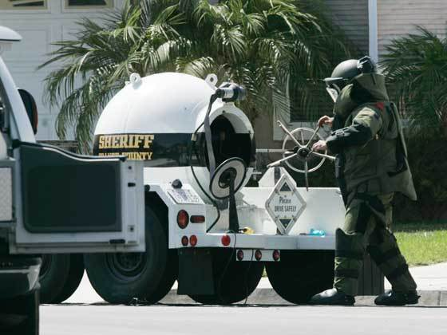

  *Decisions without actions are pointless. Actions without decisions are reckless.* 
  
  -- John Boyd

.. _introduction-introduction:

Introduction
============

Problem - The Tale of Two Architectural Explosion Chambers
^^^^^^^^^^^^^^^^^^^^^^^^^^^^^^^^^^^^^^^^^^^^^^^^^^^^^^^^^^

.. note::

  I wrote this document to help me think through my problems and to try and find a
  straightforward way to implement the 
 parallel tag using miros.

Software engineers will map their system's behavioral requirements onto a
picture, then use that picture as a guide for how to write their software.

It is very natural for a software engineer to draw a set of bubbles connected by
arrows.  The bubbles represent states of the system and the arrows represent
events which require a change of state.  If the drawing is just a set of bubbles
connected by arrows, it is called a finite state machine (FSM).

The problem with FSMs are that they are architectural time bombs.  As the number
of requirements increase in your system, the number of bubbles and arrows
required to model it, significantly outpaces the number of requirements.  This
effect is so dramatic, it has been given the name: "state-space-explosion".

Any useful engineering formalism (or way of modelling your
problem) should compress complexity within the model, not make your model more
complex than the real system.

David Harel neatly solved the "state space explosion" problem by inventing a
different type of picture.  He invented hierarchical state machines and parallel
regions.  A hierarchical state machine allows for bubbles to be drawn within
bubbles; an inner bubble containing all of the behavior described by an outer
bubble.  A parallel region, is a dashed line on a picture.  Each region marked
off with this dashed line describes concurrent operation.

David Harel's drawing rules ensnare tremendous amounts of behavioral complexity.
If you model system's using his techniques you will end up with small and
intuitive diagrams which can easily adapt to future requirements.

When state machines are running in parallel regions they are running at the same
time: both regions react to the events which are sent to the statechart.  This
means that your statemachine can have more than one active state.  Such an idea
is easy for a theorist to envision, but it is much harder for the practitioner
to implement.  Regions can exist within regions, and each region represents a
parallel execution of code, with access to common outer memory and a need to
react to events managed by other parts of the program.  It is like applying
topology to your system forks.

Miro Samek liberated statecharts in his 2000 paper titled `State-Oriented
Programming <https://www.embedded.com/state-oriented-programming/>`_.  His
algorithm supported the bubble within bubble part of the statemachine picture,
but it did not support the dashed line: parallel regions. He went about
addressing the "state space explosion" problem in a different way, he invented the
`orthogonal component pattern
<https://aleph2c.github.io/miros/patterns.html#patterns-orthogonal-component>`_:
an HSM running within another HSM.

Miro Samek's approach was built for small processors, and it ran fast and used
very few resources.  It was not as pictorially expressive as the parallel
region, as we will see in the next section.

Both men went about containing the architecture "state space explosion" caused from FSMs.
One method was practical from an implementation perspective and the other was
more pictorially expressive in how it described concurrency.

This project is about having cake and eating it too.  The library this project
is dependent upon uses Miro Samek's algorithm and thereby doesn't implicitly
support parallel regions, but it does support the orthogonal component pattern.
So I will use the orthogonal component as a kind of assembly language.  I will
map a parallel region described within an XML document onto a set of orthogonal
regions.  One orthogonal region may contain 0 or more other orthogonal regions,
in a kind of onion-type architecture.  An event will be able to cause
transitions between these orthogonal regions. From the outside, it will look
like parallel region's are supported.  So this library is about bringing
parallel regions to the Miro Samek algorithm.

.. _introduction-what-this-documentation-will-provide:

